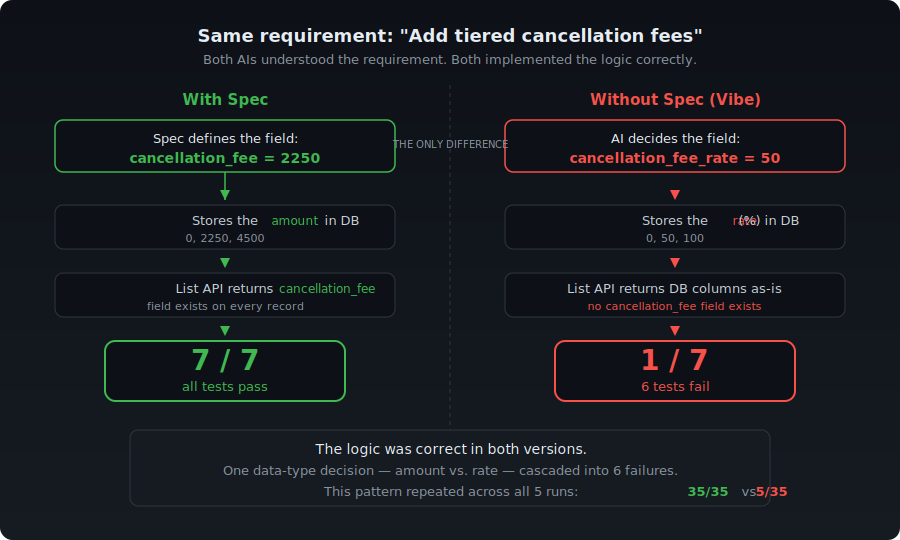

[日本語版はこちら](README.ja.md)

# Spec Grounding

**Same AI. Same change request. 5 runs each. With a spec: 35/35 passed. Without: 5/35.**

The only difference was six Markdown files.

<p align="center">
  
</p>

---

## The Problem

Vibe coding works surprisingly well for generating an initial app. The problem starts when you need to change something.

I asked the same AI model (Claude Sonnet 4.6 via Claude Code) to make the same change to a salon reservation system: switch from a simple binary cancellation policy to a tiered one (free if 72h+ before, 50% fee if 24–72h, 100% if under 24h).

One version received the change request as a natural language instruction:

> "Change the cancellation policy of this salon reservation app to a tiered system. Currently it's just a binary choice of whether it's a same-day cancellation, but I want it so that cancellations 72+ hours before are free, 24–72 hours before incur a 50% fee, and under 24 hours incur a 100% fee. No-shows are 100%. No fee for reservation modifications."

The other received an updated 6-file specification (~800 lines) defining exactly what data fields to add, what types they have, and how each process references them.

Both versions built successfully. Both understood the requirement. Then I ran 7 behavioral tests:

| Test | With Spec | Without Spec |
|------|:---------:|:------------:|
| Cancel 72h+ before → fee = ¥0, no penalty | PASS | FAIL |
| Cancel 24–72h before → fee = 50%, penalty +1 | PASS | FAIL |
| Cancel < 24h before → fee = 100%, penalty +1 | PASS | FAIL |
| No-show → fee = 100%, penalty +1 | PASS | FAIL |
| Modification → fee = ¥0, no penalty | PASS | FAIL |
| `cancellation_fee` field exists on record | PASS | FAIL |
| Penalty limit blocks new reservations | PASS | PASS |
| **Total** | **7/7** | **1/7** |

I repeated this experiment 5 times independently — fresh generation each time, no prior results in context.

| Trial | With Spec | Without Spec |
|-------|:---------:|:------------:|
| 1 | 7/7 | 1/7 |
| 2 | 7/7 | 1/7 |
| 3 | 7/7 | 1/7 |
| 4 | 7/7 | 1/7 |
| 5 | 7/7 | 1/7 |

Zero variance across all 10 runs. Full details in [`benchmark/results/benchmark-n5-result.md`](benchmark/results/benchmark-n5-result.md).

To verify this result isn't an artifact of field-name assumptions in the test suite, I re-ran the cancellation tests using a field-name-agnostic method: instead of checking specific field names, the test scans all numeric fields in the response for the expected yen amount. Spec: 3/3. Vibe: 1/3 — the same gap. Applying the identical method to a simpler change (adding a ¥500 nomination fee) showed no difference: 3/3 vs 3/3. The gap appears only when the change requires a non-obvious data structure decision. Details in [`benchmark/results/field-agnostic-benchmark-2026-03-16.md`](benchmark/results/field-agnostic-benchmark-2026-03-16.md).

## What Went Wrong

The AI didn't misunderstand the requirement. It implemented the tiered logic correctly in both cases.

The difference was a single data structure decision:

| | With Spec | Without Spec |
|---|---|---|
| What gets stored | `cancellation_fee` = amount in yen (¥2,250) | `cancellation_fee_rate` = percentage (50) |
| Policy storage | Dedicated `cancellation_policy` table | Key-value pairs in `system_settings` |

The spec explicitly defined `cancellation_fee` as an integer field storing yen amounts. Without that definition, the AI made a reasonable but different choice — storing the rate instead of the amount.

**Here's how one decision cascaded into six failures:** the vibe version stored only the rate (%) in the database, not the computed amount (¥). Its cancel endpoint did compute the yen amount in the response, but the reservation list API returned database columns as-is — so the `cancellation_fee` field simply didn't exist on reservation records. Every test that checked the persisted fee amount failed, not because the tier logic was wrong, but because the data wasn't where downstream code expected it.

This wasn't a one-off accident. In 5 independent runs, every vibe-coded version made the same choice: store `cancellation_fee_rate` (a percentage) instead of `cancellation_fee` (a yen amount). 0 out of 5 stored the computed amount. Without a data structure definition, the AI defaults to the same reasonable-but-wrong decision every time.

---

This repository demonstrates two claims: **reliability under change**, and **scalability to larger systems.** The salon benchmark above covers the first. The next section covers both.

## Case 2: Does It Scale?

The salon reservation system was small — 6 screens, 13 APIs. Can the same approach handle a larger system with real feature changes?

I generated a **BtoB Sales Management System** from 8 specification files (2,708 lines of spec):

| | Salon Reservation | BtoB Sales Management | Scale |
|---|:-:|:-:|:-:|
| Spec files | 6 | 8 | 1.3x |
| Spec lines | ~800 | 2,708 | 3.4x |
| Screens | 6 | 16 | 2.7x |
| API routes | 13 | 29 | 2.2x |
| Lines of code | 2,861 | 9,390 | **3.3x** |
| Build result | First pass | First pass | — |
| Manual fixes | 0 | 0 | — |

16 screens covering the full order-to-cash cycle: quotations, orders, inventory, shipping, invoicing, payments, and master data management. Every screen generated from spec. Zero manual fixes. Single build pass.

I then ran three different change requests against this system — each tested with both a spec-driven and a vibe-coded version:

| Change | Modules Affected | With Spec | Without Spec |
|--------|-----------------|:---------:|:------------:|
| Volume discount (tiered pricing) | Orders | 7/7 | 7/7 |
| Credit limit enforcement | Orders, Billing, Payments | 5/5 | 4/5 |
| Returns + credit notes | Shipping, Inventory, Billing, Reconciliation | **8/8** | **2/8** |

The pattern matches the salon finding. Simple, additive changes (volume discount) work fine without a spec — 7/7 on both sides. The gap appears when the change requires deciding *how to represent new data within existing structures*.

In the returns case, the vibe prompt explicitly said "credit note (negative invoice)." The AI understood the concept but created a separate `credit_notes` table instead of storing negative amounts in the existing `invoices` table. This broke integration with billing, reconciliation, and outstanding balance calculation — 6 of 8 tests failed. Same pattern as the salon: understanding is not the problem; choosing the right data structure is.

Full results: [returns](benchmark/results/returns-benchmark-2026-03-16.md) | [volume discount](benchmark/results/volume-discount-benchmark-2026-03-16.md) | [credit limit](benchmark/results/credit-limit-benchmark-2026-03-16.md)

**[Explore the returns specification interactively →](https://shiyosakura.github.io/githubpage/)**

---

## What Makes These Specs Different

Most specifications describe behavior in natural language. These specs are different — every statement is anchored to a concrete data field.

### Every field reference is explicit

All data references use backtick notation tied to defined field names. There are no ambiguous phrases like "the customer's name" — instead, every reference resolves to a specific table and column:

```
Join `Customer Master` to attach
`Customer Master[quotation_data.customer_id].customer_name` to each row.
```

This means the AI never has to guess which table a piece of data comes from or what a field is called. Every backtick reference maps 1:1 to a field in the data structure definitions.

### Every branch has an else

Specifications typically describe what happens when a condition is true. These specs describe both sides of every branch:

```
- If a special price record exists (`unit_price_master_id` ≥ 1)
  ⇒ Set `quotation_line_item.unit_price` to
    `Unit Price Master[unit_price_master_id].special_price`
- If no matching special price record exists
  ⇒ Set `quotation_line_item.unit_price` to
    `Product Master[product_id].standard_unit_price`
```

No implicit defaults. No "otherwise, do nothing." The AI sees the complete decision tree, not just the happy path.

### Fixed §2 / §3 / §4 structure

Every process follows the same three-section format:

| Section | Role | What it answers |
|---------|------|-----------------|
| **§2** — Condition Judgments | Branching logic only. No data writes. | "Which path do we take?" |
| **§3** — Data Update | Step-by-step data operations (retrieve, join, filter, write). | "What data changes?" |
| **§4** — Display Updates | UI rendering rules: what to show, what format, what formula. | "What does the user see?" |

This separation means the AI never conflates "deciding what to do" with "doing it" with "showing the result." Each section has one job.

### The result: traceable, verifiable specifications

These patterns are not just style choices. They enable automated verification: every backtick reference can be checked against the data structure definitions. If a spec references a field that doesn't exist, or if a defined field is never referenced, the system catches it before any code is generated.

**[Explore the specifications interactively →](https://shiyosakura.github.io/githubpage/)**

The traceability viewer shows the three-layer structure — SIP analysis, data definitions, and specifications — with clickable links between them.

---

## How Spec Grounding Works

Code manipulates data. UI displays data. APIs transfer data. Everything depends on data structure — yet when you give an AI a natural language change request, the AI has to make dozens of implicit decisions about it: what fields to add, what types to use, what to store vs. what to compute on the fly. These decisions are reasonable in isolation, but they compound. A single field stored as a percentage instead of an amount breaks every downstream query, every UI display, every test. **The bottleneck is not the AI's intelligence — it's the absence of data structure decisions in the input.**

The idea of generating code from schemas is not new — schema-driven generation, TDD, and DSL-based approaches all exist. Spec Grounding differs in that the data structure doesn't produce code directly. It produces *human-reviewable specifications* as an intermediate layer: the data structure constrains the spec, and the spec constrains the code. This middle layer is where ambiguity gets caught — before it reaches the codebase.

The process has three layers, each depending on the one above:

```
SIP (Screen–Input–Process analysis)
  ↓ determines what data is needed
Data Structure Definitions
  ↓ each spec section references concrete fields
Detailed Specifications
  ↓ deterministic input for code generation
Code
```

**SIP** analyzes each screen to identify every piece of displayed information, every user action, and every background process. This produces a complete inventory of what data the system must handle.

**Data Structure Definitions** formalize that inventory into three categories:

- Master data (read-only reference tables)
- Persistent data (saved state that changes over time)
- Screen data (temporary data for UI rendering)

Every field has a name, type, range, default value, and description.

**Detailed Specifications** reference these data definitions directly. Each business rule is written as "read field X, check condition Y, write field Z." There is no room for the AI to improvise a data structure.

When a requirement changes, you update the data structure first, then propagate the change through every spec section that references the affected fields. This is what happened in the benchmark: the cancellation policy change touched 6 files and 29 lines, all traceable from the data structure outward.

### The specs themselves are AI-generated

Writing 800 lines of specification by hand would defeat the purpose. The specifications in this repository were generated using Claude Code with a set of domain knowledge files and a multi-agent workflow. The knowledge base contains structural patterns for target categories (e.g., reservation systems, sales management), and each agent stage (SIP analysis → data structure definition → detailed specification) takes the output of the previous stage as its input. Automated consistency checks verify that every field reference resolves to a defined data structure and that every defined field appears in at least one specification. The human role is review and approval at stage boundaries — not authoring.

## Key Insight

Both AIs understood the requirement. Both implemented the tiered logic correctly. The difference was not intelligence — it was data structure.

**The spec doesn't tell the AI what to think. It tells the AI what data to produce.**

## Repository Structure

```
benchmark/
├── specs/
│   ├── before/              # Salon: original specification (6 files)
│   ├── after/               # Salon: tiered cancellation (6 files)
│   ├── after-nomination/    # Salon: nomination fee addition (6 files)
│   ├── sales/               # BtoB: base specification (8 files)
│   ├── sales-after-credit/  # BtoB: credit limit enforcement
│   ├── sales-after-discount/# BtoB: volume discount
│   └── sales-after-returns/ # BtoB: returns + credit notes
├── app-spec/                # Salon: generated from spec
├── app-vibe/                # Salon: generated from natural language
├── app-sales*/              # BtoB: base + 3 change pairs (spec/vibe each)
├── tests/                   # All test suites (Vitest)
└── results/                 # Benchmark result reports

# Interactive traceability viewer (separate repository):
# https://shiyosakura.github.io/githubpage/
```

## Reproduce the Benchmark

### Salon Reservation — Change Tracking

```bash
# 1. Start the spec-driven app
cd benchmark/app-spec
npm install && rm -f salon.db && npx next start -p 3097

# 2. Start the vibe-coded app (in another terminal)
cd benchmark/app-vibe
npm install && rm -f salon.db && npx next start -p 3098

# 3. Run tests against each (in another terminal)
cd benchmark/tests && npm install

BASE_URL=http://localhost:3097 npx vitest run --reporter=verbose  # spec: all pass
BASE_URL=http://localhost:3098 npx vitest run --reporter=verbose  # vibe: cancellation fees fail

# Run only field-agnostic tests
BASE_URL=http://localhost:3097 npx vitest run cancellation-fee-agnostic nomination-fee
```

### BtoB Sales Management — Change Tracking + Scale

The BtoB app is not included in this repository (it can be regenerated from the specs). To reproduce: generate an app from `benchmark/specs/sales/`, then run tests against it.

```bash
# Run BtoB tests against a running app
cd benchmark/tests && npm install
BASE_URL=http://localhost:3001 npx vitest run returns --reporter=verbose
BASE_URL=http://localhost:3001 npx vitest run volume-discount --reporter=verbose
BASE_URL=http://localhost:3001 npx vitest run credit-limit --reporter=verbose
```

## Environment

- AI Model: Claude Sonnet 4.6 (via Claude Code) — used for all benchmark code generation
- Framework: Next.js 16, TypeScript, Tailwind CSS, SQLite (better-sqlite3)
- Test framework: Vitest 3.2.4

## License

MIT
