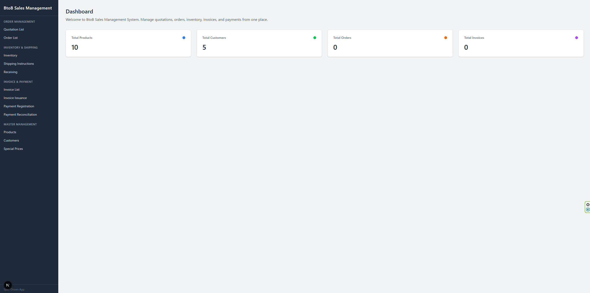
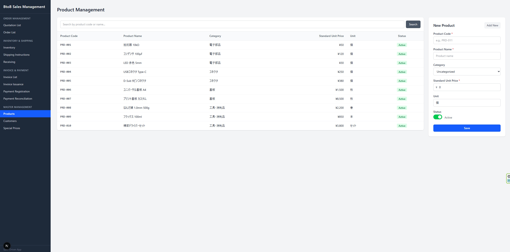
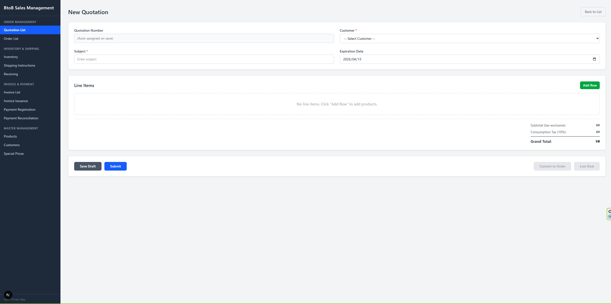

# Spec Grounding

**Same AI. Same change request. With a spec: 7/7 passed. Without: 1/7.**

The only difference was six Markdown files.

---

## The Problem

Vibe coding works surprisingly well for generating an initial app. The problem starts when you need to change something.

I asked the same AI model (Claude Opus 4.6) to make the same change to a salon reservation system: switch from a simple binary cancellation policy to a tiered one (free if 72h+ before, 50% fee if 24–72h, 100% if under 24h).

One version received the change request as a natural language instruction. The other received an updated 6-file specification.

Both versions built successfully. Both understood the requirement. Then I ran 7 behavioral tests:

| Test | With Spec | Without Spec |
|---|:---:|:---:|
| Cancel 72h+ before → fee = ¥0, no penalty | PASS | FAIL |
| Cancel 24–72h before → fee = 50%, penalty +1 | PASS | FAIL |
| Cancel < 24h before → fee = 100%, penalty +1 | PASS | FAIL |
| No-show → fee = 100%, penalty +1 | PASS | FAIL |
| Modification → fee = ¥0, no penalty | PASS | FAIL |
| `cancellation_fee` field exists on record | PASS | FAIL |
| Penalty limit blocks new reservations | PASS | PASS |
| **Total** | **7/7** | **1/7** |

## What Went Wrong

The AI didn't misunderstand the requirement. It implemented the tiered logic correctly in both cases.

The difference was a single data structure decision:

| | With Spec | Without Spec |
|---|---|---|
| What gets stored | `cancellation_fee` = amount in yen (¥2,250) | `cancellation_fee_rate` = percentage (50) |
| Policy storage | Dedicated `cancellation_policy` table | Key-value pairs in `system_settings` |

The spec explicitly defined `cancellation_fee` as an integer field storing yen amounts. Without that definition, the AI made a reasonable but different choice — storing the rate instead of the amount. One design decision, six test failures.

This is not a cherry-picked edge case. This is what happens every time the AI has to decide *what shape the data takes* without being told.

---

This repository demonstrates two claims: **reliability under change**, and **scalability to larger systems.** The salon benchmark above covers the first. The next section covers the second.

## Case 2: Does It Scale?

The salon reservation system was small — 6 screens, 13 APIs. Can the same approach produce a larger system?

I generated a **BtoB Sales Management System** from 8 specification files (2,708 lines of spec):

| | Salon Reservation | BtoB Sales Management | Scale |
|---|:---:|:---:|:---:|
| Spec files | 6 | 8 | 1.3x |
| Spec lines | ~800 | 2,708 | 3.4x |
| Screens | 6 | 16 | 2.7x |
| API routes | 13 | 29 | 2.2x |
| Lines of code | 2,861 | 9,390 | **3.3x** |
| Build result | First pass | First pass | — |
| Manual fixes | 0 | 0 | — |

16 screens covering the full order-to-cash cycle: quotations, orders, inventory, shipping, invoicing, payments, and master data management.

<p align="center">
  
</p>
<p align="center">
  
</p>
<p align="center">
  
</p>

Every screen was generated from spec. Zero manual fixes. Single build pass.

---

## What Makes These Specs Different

Most specifications describe behavior in natural language. These specs are different — every statement is anchored to a concrete data field.

### Every field reference is explicit

All data references use backtick notation tied to defined field names. There are no ambiguous phrases like "the customer's name" — instead, every reference resolves to a specific table and column:

```markdown
Join `Customer Master` to attach
`Customer Master[quotation_data.customer_id].customer_name` to each row.
```

This means the AI never has to guess which table a piece of data comes from or what a field is called. Every backtick reference maps 1:1 to a field in the data structure definitions.

### Every branch has an else

Specifications typically describe what happens when a condition is true. These specs describe both sides of every branch:

```markdown
- If a special price record exists (`unit_price_master_id` ≥ 1)
  ⇒ Set `quotation_line_item.unit_price` to
    `Unit Price Master[unit_price_master_id].special_price`
- If no matching special price record exists
  ⇒ Set `quotation_line_item.unit_price` to
    `Product Master[product_id].standard_unit_price`
```

No implicit defaults. No "otherwise, do nothing." The AI sees the complete decision tree, not just the happy path.

### Fixed §2 / §3 / §4 structure

Every process follows the same three-section format:

| Section | Role | What it answers |
|---|---|---|
| **§2** — Condition Judgments | Branching logic only. No data writes. | "Which path do we take?" |
| **§3** — Data Update | Step-by-step data operations (retrieve, join, filter, write). | "What data changes?" |
| **§4** — Display Updates | UI rendering rules: what to show, what format, what formula. | "What does the user see?" |

This separation means the AI never conflates "deciding what to do" with "doing it" with "showing the result." Each section has one job.

### The result: traceable, verifiable specifications

These patterns are not just style choices. They enable automated verification: every backtick reference can be checked against the data structure definitions. If a spec references a field that doesn't exist, or if a defined field is never referenced, the system catches it before any code is generated.

**[Explore the specifications interactively →](https://shiyosakura.github.io/githubpage/)**

The traceability viewer shows the three-layer structure — SIP analysis, data definitions, and specifications — with clickable links between them.

---

## Why Data Structure Is the Bottleneck

Code manipulates data. UI displays data. APIs transfer data. Everything depends on data structure.

When you give an AI a natural language change request, the AI has to make dozens of implicit decisions about data structure: what fields to add, what types to use, what to store vs. what to compute on the fly. These decisions are reasonable in isolation, but they compound. A single field stored as a percentage instead of an amount breaks every downstream query, every UI display, every test.

The debate about which AI model is "better at coding" misses the point. **The bottleneck is not the AI's intelligence — it's the absence of data structure decisions in the input.**

A specification that fixes the data structure eliminates the AI's guesswork. Every section of the spec becomes a statement about data: this field exists, it has this type, this range, this default. The AI doesn't need to be creative. It just needs to follow the structure.

## How Spec Grounding Works

Spec Grounding is a methodology for writing specifications that are grounded in data structure definitions. The process has three layers, each depending on the one above:

```
SIP (Screen–Input–Process analysis)
  ↓  determines what data is needed
Data Structure Definitions
  ↓  each spec section references concrete fields
Detailed Specifications
  ↓  deterministic input for code generation
Code
```

**SIP** analyzes each screen to identify every piece of displayed information, every user action, and every background process. This produces a complete inventory of what data the system must handle.

**Data Structure Definitions** formalize that inventory into three categories:
- Master data (read-only reference tables)
- Persistent data (saved state that changes over time)
- Screen data (temporary data for UI rendering)

Every field has a name, type, range, default value, and description.

**Detailed Specifications** reference these data definitions directly. Each business rule is written as "read field X, check condition Y, write field Z." There is no room for the AI to improvise a data structure.

When a requirement changes, you update the data structure first, then propagate the change through every spec section that references the affected fields. This is what happened in the benchmark: the cancellation policy change touched 6 files and 29 lines, all traceable from the data structure outward.

This process is not manual. Spec Grounding runs inside AI coding agents as a multi-stage pipeline: each stage receives the output of the previous stage as its input, so every decision is constrained by what has already been defined. A domain knowledge base supplies structural patterns for the target category (e.g., reservation systems, e-commerce, sales management) — not as templates to copy, but as reference points that anchor the AI's output to proven data shapes.

During generation, automated consistency checks verify that every field referenced in a specification actually exists in the data structure definitions, and that every defined field is accounted for in at least one specification. The human role is review and approval at stage boundaries; the AI handles expansion and cross-referencing.

## Key Insight

Both AIs understood the requirement. Both implemented the tiered logic correctly. The difference was not intelligence — it was data structure.

**The spec doesn't tell the AI what to think. It tells the AI what data to produce.**

## Repository Structure

```
benchmark/
├── specs/
│   ├── before/              # Original salon specification (6 files)
│   ├── after/               # Updated specification with tiered cancellation
│   └── sales/               # BtoB Sales Management specification (8 files)
├── app-spec/                # Salon: generated from the updated specification
├── app-vibe/                # Salon: generated from natural language instruction
├── app-sales/               # BtoB: generated from specification (16 screens, 29 APIs)
├── tests/                   # Salon: 7 behavioral tests (Vitest)
└── results/                 # Benchmark result reports
docs/
└── viewer/                  # Interactive traceability viewer (GitHub Pages)
```

## Reproduce the Benchmark

### Salon Reservation — Change Tracking

```bash
# 1. Start the spec-driven app
cd benchmark/app-spec
npm install && rm -f salon.db && npx next start -p 3097

# 2. Start the vibe-coded app (in another terminal)
cd benchmark/app-vibe
npm install && rm -f salon.db && npx next start -p 3098

# 3. Run tests against each (in another terminal)
cd benchmark/tests && npm install

BASE_URL=http://localhost:3097 npx vitest run --reporter=verbose  # spec: 7/7
BASE_URL=http://localhost:3098 npx vitest run --reporter=verbose  # vibe: 1/7
```

### BtoB Sales Management — Scale

```bash
cd benchmark/app-sales
npm install && npx next dev -p 3100
# Open http://localhost:3100
```

## Environment

- AI Model: Claude Opus 4.6 — used for all code generation
- Framework: Next.js 16, TypeScript, Tailwind CSS, SQLite (better-sqlite3)
- Test framework: Vitest 3.2.4

## License

MIT
