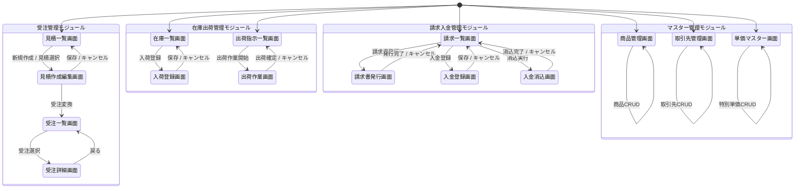

# BtoB販売管理システム SIP分解

> 中小企業向けのBtoB販売管理システム。
> 見積→受注→出荷→請求→入金のフルライフサイクルを管理する。
> 営業担当・倉庫担当・経理担当・管理者の4部門が利用する。
> 4モジュール（受注管理・在庫出荷管理・請求入金管理・マスター管理）・15画面構成。
> フレームワーク委譲: 認証・セッション管理、帳票PDF生成（請求書PDF出力）、メール通知。スコープ列は省略。
> 会計仕訳連携・EDI連携・分割受注・返品処理・消費税率詳細（軽減税率等）はスコープ外。

---

## 画面遷移図

---

## 1. 見積一覧画面（受注管理モジュール：営業担当）

### Scene（表示情報）

| 表示要素 | 説明 |
|:--|:--|
| 見積一覧テーブル | 見積番号・取引先名・件名・見積金額・ステータス・作成日・有効期限を表示 |
| ステータスフィルタ | 作成中 / 提出済 / 受注済 / 失注 / 期限切れ で絞り込み |
| テキスト検索欄 | 見積番号・取引先名で検索 |
| 新規作成ボタン | 見積作成/編集画面へ遷移（新規モード） |

### Input（ユーザー操作）

| 操作 | 条件 | 遷移先 / 効果 |
|:--|:--|:--|
| 見積選択 | 常時 | 見積作成/編集画面へ遷移（編集モード。見積IDを引き継ぎ） |
| 新規作成 | 常時 | 見積作成/編集画面へ遷移（新規モード） |
| ステータスフィルタ切替 | 常時 | 一覧を絞り込み |
| テキスト検索実行 | 常時 | 検索結果で一覧を更新 |

### Process（バックグラウンド処理）

**― 見積表示 ―**

| 処理名 | トリガー | 概要 |
|:--|:--|:--|
| 見積一覧取得 | 画面表示時 | `見積データ`を取得し`取引先マスター`を結合して取引先名を付与。デフォルトは作成日降順。→ ステータスフィルタリング |
| ステータスフィルタリング | フィルタ操作時 / 画面表示時 | 選択ステータスに一致する`見積データ`のみ表示。テキスト検索との併用可 → 見積一覧取得 |
| テキスト検索 | 検索実行時 | `見積データ.見積番号`・`取引先マスター.取引先名`に対する部分一致検索。ステータスフィルタとの併用可 → 見積一覧取得 |

### データ逆算メモ

| データ候補名 | 区分（仮） | 根拠 |
|:--|:--|:--|
| `見積データ` | セーブ | 見積ID・見積番号・取引先ID・件名・ステータス・有効期限・作成日時・更新日時・作成者ID |
| `取引先マスター` | マスター | 取引先ID・取引先コード・取引先名・住所・連絡先・締め日・与信限度額 |
| `見積ステータス` | enum | 作成中・提出済・受注済・失注・期限切れ |

---

## 2. 見積作成/編集画面（受注管理モジュール：営業担当）

### Scene（表示情報）

| 表示要素 | 説明 |
|:--|:--|
| ヘッダー情報フォーム | 取引先（ドロップダウン）・件名・有効期限の入力 |
| 明細行テーブル | 商品・数量・単価・小計を行単位で編集。行追加・行削除ボタン付き |
| 合計金額表示 | 明細小計の合算（UIフック: `Σ(数量 × 単価)`）・税額（UIフック: `合計金額 × 税率`）・税込合計 |
| 提出ボタン | ステータスを「提出済」に変更して保存 |
| 保存ボタン | 現在ステータスのまま保存（作成中） |
| 受注変換ボタン | ステータス=提出済の場合に有効。受注データを生成 |
| 失注ボタン | ステータス=提出済の場合に有効 |
| キャンセルボタン | 変更破棄して見積一覧画面へ戻る |

### Input（ユーザー操作）

| 操作 | 条件 | 遷移先 / 効果 |
|:--|:--|:--|
| 取引先選択 | 常時 | 選択取引先をヘッダーにプリセット |
| 明細行追加 | 常時 | 空の明細行を末尾に追加 |
| 商品選択（明細行） | 明細行あり | 選択商品に対応する単価を自動セット（単価マスター優先→商品マスター標準単価） |
| 数量入力（明細行） | 明細行あり | 数量を変更。小計を再計算 |
| 単価入力（明細行） | 明細行あり | 単価を手動上書き |
| 明細行削除 | 明細行あり | 対象行を削除 |
| 保存 | 常時 | 見積保存処理を実行（ステータス=作成中のまま） |
| 提出 | 常時 | 見積提出処理を実行（ステータスを提出済に変更） |
| 受注変換 | ステータス=提出済 | 受注変換処理を実行 → 受注一覧画面へ遷移 |
| 失注 | ステータス=提出済 | 失注処理を実行 → 見積一覧画面へ遷移 |
| キャンセル | 常時 | 見積一覧画面へ遷移 |

### Process（バックグラウンド処理）

**― 見積初期化 ―**

| 処理名 | トリガー | 概要 |
|:--|:--|:--|
| 見積初期化 | 画面表示時 | 新規モード: 空のヘッダーフォームと空の明細行0件を表示。`見積番号`を採番（自動）。編集モード: `見積データ`・`見積明細`を読み込みフォームにプリセット → 単価自動セット |

**― 明細操作 ―**

| 処理名 | トリガー | 概要 |
|:--|:--|:--|
| 単価自動セット | 商品選択時 | `単価マスター`から（取引先ID・商品ID）の組合せで特別単価を検索。存在すれば`見積明細.単価`にセット。存在しなければ`商品マスター.標準単価`をセット → 合計金額再計算 |
| 合計金額再計算 | 数量・単価変更時 / 行追加・削除時 | 全明細行の `数量 × 単価` を合算して合計金額を算出。税額・税込合計を更新（UIフック）。データへの書き込みは保存時のみ |

**― 見積保存 ―**

| 処理名 | トリガー | 概要 |
|:--|:--|:--|
| 見積保存 | 保存操作時 | バリデーション（取引先必須・件名必須・明細行 ≥ 1・各行に商品と数量 ≥ 1）。`見積データ`を新規作成または更新（ステータス=作成中）。`見積明細`を全件置換 → 見積一覧画面へ遷移 |
| 見積提出 | 提出操作時 | バリデーション（見積保存と同条件）。`見積データ`を保存しステータスを「提出済」に更新。`見積明細`を全件置換 → 見積一覧画面へ遷移 |

**― ステータス遷移 ―**

| 処理名 | トリガー | 概要 |
|:--|:--|:--|
| 受注変換 | 受注変換操作時 | `見積明細`の内容（商品ID・数量・単価）をコピーして`受注データ`・`受注明細`を新規作成。`見積データ.ステータス`を「受注済」に更新 → 与信チェック |
| 失注処理 | 失注操作時 | `見積データ.ステータス`を「失注」に更新 → 見積一覧画面へ遷移 |

**― 受注確定（受注変換からの連鎖） ―**

| 処理名 | トリガー | 概要 |
|:--|:--|:--|
| 与信チェック | 受注変換から連鎖 | 対象取引先の未入金残高（未消込`請求データ`合計 + 受注確定済かつ未請求の`受注データ`合計）と今回受注金額の合算が`取引先マスター.与信限度額`を超える場合は`受注データ.与信警告フラグ`をtrueに設定。与信超過でも受注確定はブロックしない → 受注確定処理 |
| 受注確定処理 | 与信チェック完了後 | `受注データ.ステータス`を「受注確定」に更新。`商品在庫.引当数`を`受注明細`の各商品の数量分加算。`出荷指示データ`を新規作成（`受注ID`を紐付け、ステータス=未出荷）。`出荷指示明細`を`受注明細`の内容で作成（出荷済数量=0） → 受注一覧画面へ遷移 |

### データ逆算メモ

| データ候補名 | 区分（仮） | 根拠 |
|:--|:--|:--|
| `見積明細` | セーブ | 見積明細ID・見積ID・商品ID・数量・単価・商品名（見積時点スナップショット）。1見積に複数 |
| `商品マスター` | マスター | 商品ID・商品コード・商品名・カテゴリID・標準単価・単位・有効フラグ |
| `単価マスター` | マスター | 単価マスターID・取引先ID・商品ID・特別単価 |
| `受注データ` | セーブ | 受注ID・受注番号・取引先ID・見積ID・件名・ステータス・与信警告フラグ・受注日時・更新日時 |
| `受注明細` | セーブ | 受注明細ID・受注ID・商品ID・数量・単価・商品名（受注時点スナップショット）・出荷済数量。1受注に複数 |
| `受注ステータス` | enum | 受注確定・出荷中・出荷完了・請求済・完了・キャンセル |
| `商品在庫` | セーブ | 商品ID・実在庫数・引当数 |
| `出荷指示データ` | セーブ | 出荷指示ID・受注ID・取引先ID・ステータス・作成日時 |
| `出荷指示明細` | セーブ | 出荷指示明細ID・出荷指示ID・受注明細ID・商品ID・指示数量・出荷済数量（出荷済数量=0で未出荷、指示数量と一致で完了） |
| `出荷指示ステータス` | enum | 未出荷・出荷中・出荷完了・キャンセル（出荷指示データのステータス。明細レベルは出荷済数量から導出） |

---

## 3. 受注一覧画面（受注管理モジュール：営業担当）

### Scene（表示情報）

| 表示要素 | 説明 |
|:--|:--|
| 受注一覧テーブル | 受注番号・取引先名・件名・受注金額・ステータス・受注日・出荷状況を表示 |
| ステータスフィルタ | 受注確定 / 出荷中 / 出荷完了 / 請求済 / 完了 / キャンセル で絞り込み |
| テキスト検索欄 | 受注番号・取引先名で検索 |

### Input（ユーザー操作）

| 操作 | 条件 | 遷移先 / 効果 |
|:--|:--|:--|
| 受注選択 | 常時 | 受注詳細画面へ遷移（受注IDを引き継ぎ） |
| ステータスフィルタ切替 | 常時 | 一覧を絞り込み |
| テキスト検索実行 | 常時 | 検索結果で一覧を更新 |

### Process（バックグラウンド処理）

**― 受注表示 ―**

| 処理名 | トリガー | 概要 |
|:--|:--|:--|
| 受注一覧取得 | 画面表示時 | `受注データ`を取得し`取引先マスター`を結合して取引先名を付与。デフォルトは受注日降順。→ ステータスフィルタリング |
| ステータスフィルタリング | フィルタ操作時 / 画面表示時 | 選択ステータスに一致する`受注データ`のみ表示。テキスト検索との併用可 → 受注一覧取得 |
| テキスト検索 | 検索実行時 | `受注データ.受注番号`・`取引先マスター.取引先名`に対する部分一致検索 → 受注一覧取得 |

### データ逆算メモ

| データ候補名 | 区分（仮） | 根拠 |
|:--|:--|:--|
| （`受注データ`・`受注ステータス`・`取引先マスター`は画面2で定義済み） | — | — |

---

## 4. 受注詳細画面（受注管理モジュール：営業担当）

### Scene（表示情報）

| 表示要素 | 説明 |
|:--|:--|
| 受注ヘッダー情報 | 受注番号・取引先名・件名・受注日・ステータスを表示（読み取り専用） |
| 受注明細テーブル | 商品名・数量・単価・小計・出荷済数量・未出荷数量を明細行単位で表示 |
| 出荷状況サマリー | 全明細の出荷済 / 未出荷の概況を表示 |
| 与信警告表示 | 与信チェックで警告が発生していた場合に警告メッセージを表示 |
| キャンセルボタン | ステータス=受注確定の場合のみ有効 |
| 戻るボタン | 受注一覧画面へ遷移 |

### Input（ユーザー操作）

| 操作 | 条件 | 遷移先 / 効果 |
|:--|:--|:--|
| キャンセル | ステータス=受注確定 | 受注キャンセル処理を実行 |
| 戻る | 常時 | 受注一覧画面へ遷移 |

### Process（バックグラウンド処理）

**― 受注表示 ―**

| 処理名 | トリガー | 概要 |
|:--|:--|:--|
| 受注詳細取得 | 画面表示時 | `受注データ`・`受注明細`・`取引先マスター`を結合して表示。`受注明細.出荷済数量`から未出荷数量（UIフック: `数量 - 出荷済数量`）を算出して表示。`受注データ.与信警告フラグ`=trueの場合は与信警告メッセージを表示 |

**― 受注キャンセル ―**

| 処理名 | トリガー | 概要 |
|:--|:--|:--|
| 受注キャンセル | キャンセル操作時 | `受注データ.ステータス`を「キャンセル」に更新。`受注明細`の各商品の数量を`商品在庫.引当数`から減算（引当解除）。対応する`出荷指示データ.ステータス`を「キャンセル」に更新 → 受注詳細取得 |

### データ逆算メモ

| データ候補名 | 区分（仮） | 根拠 |
|:--|:--|:--|
| （`受注データ`・`受注明細`・`取引先マスター`・`商品在庫`・`出荷指示データ`・`出荷指示ステータス`は画面1-2で定義済み） | — | — |

---

## 5. 在庫一覧画面（在庫出荷管理モジュール：倉庫担当）

### Scene（表示情報）

| 表示要素 | 説明 |
|:--|:--|
| 在庫一覧テーブル | 商品コード・商品名・カテゴリ名・実在庫数・引当数・有効在庫数（UIフック: `実在庫数 - 引当数`）を表示 |
| テキスト検索欄 | 商品コード・商品名で検索 |
| 入荷登録ボタン | 入荷登録画面へ遷移 |

### Input（ユーザー操作）

| 操作 | 条件 | 遷移先 / 効果 |
|:--|:--|:--|
| テキスト検索実行 | 常時 | 検索結果で一覧を更新 |
| 入荷登録 | 常時 | 入荷登録画面へ遷移 |

### Process（バックグラウンド処理）

**― 在庫表示 ―**

| 処理名 | トリガー | 概要 |
|:--|:--|:--|
| 在庫一覧取得 | 画面表示時 | `商品在庫`を取得し`商品マスター`・`商品カテゴリ`を結合して表示。デフォルトは商品コード昇順。有効在庫数はUIフックで算出（データには保持しない） |
| テキスト検索 | 検索実行時 | `商品マスター.商品コード`・`商品マスター.商品名`に対する部分一致検索 → 在庫一覧取得 |

### データ逆算メモ

| データ候補名 | 区分（仮） | 根拠 |
|:--|:--|:--|
| `商品カテゴリ` | マスター | カテゴリID・カテゴリ名 |
| （`商品マスター`・`商品在庫`は画面2・4で定義済み） | — | — |

---

## 6. 出荷指示一覧画面（在庫出荷管理モジュール：倉庫担当）

### Scene（表示情報）

| 表示要素 | 説明 |
|:--|:--|
| 出荷指示一覧テーブル | 出荷指示番号・取引先名・受注番号・明細数・ステータス・作成日を表示 |
| ステータスフィルタ | 未出荷 / 出荷中 / 出荷完了 で絞り込み |
| テキスト検索欄 | 出荷指示番号・取引先名で検索 |

### Input（ユーザー操作）

| 操作 | 条件 | 遷移先 / 効果 |
|:--|:--|:--|
| 出荷作業開始 | ステータス=未出荷 or 出荷中 | 出荷作業画面へ遷移（出荷指示IDを引き継ぎ） |
| ステータスフィルタ切替 | 常時 | 一覧を絞り込み |
| テキスト検索実行 | 常時 | 検索結果で一覧を更新 |

### Process（バックグラウンド処理）

**― 出荷指示表示 ―**

| 処理名 | トリガー | 概要 |
|:--|:--|:--|
| 出荷指示一覧取得 | 画面表示時 | `出荷指示データ`を取得し`取引先マスター`・`受注データ`を結合して表示。デフォルトはステータス=未出荷のみ・作成日昇順（古い順）。→ ステータスフィルタリング |
| ステータスフィルタリング | フィルタ操作時 / 画面表示時 | 選択ステータスの`出荷指示データ`のみ表示。テキスト検索との併用可 → 出荷指示一覧取得 |
| テキスト検索 | 検索実行時 | `出荷指示データ`の出荷指示番号・`取引先マスター.取引先名`に対する部分一致検索 → 出荷指示一覧取得 |

### データ逆算メモ

| データ候補名 | 区分（仮） | 根拠 |
|:--|:--|:--|
| （`出荷指示データ`・`出荷指示ステータス`・`取引先マスター`・`受注データ`は画面4・1・2で定義済み） | — | — |

---

## 7. 出荷作業画面（在庫出荷管理モジュール：倉庫担当）

### Scene（表示情報）

| 表示要素 | 説明 |
|:--|:--|
| 出荷指示ヘッダー | 出荷指示番号・取引先名・受注番号を表示（読み取り専用） |
| 出荷明細入力テーブル | 商品名・指示数量・既出荷済数量・今回出荷数量の入力欄を明細行単位で表示 |
| 出荷確定ボタン | 今回出荷数量を確定して在庫を更新 |
| キャンセルボタン | 出荷指示一覧画面へ戻る |

### Input（ユーザー操作）

| 操作 | 条件 | 遷移先 / 効果 |
|:--|:--|:--|
| 今回出荷数量入力（各明細行） | 常時 | 今回出荷する数量を入力 |
| 出荷確定 | 今回出荷数量 ≥ 1 の行が1行以上 | 出荷確定処理を実行 |
| キャンセル | 常時 | 出荷指示一覧画面へ遷移 |

### Process（バックグラウンド処理）

**― 出荷作業初期化 ―**

| 処理名 | トリガー | 概要 |
|:--|:--|:--|
| 出荷作業初期化 | 画面表示時 | `出荷指示データ`・`出荷指示明細`を取得。`商品マスター`を結合して商品名を付与。各行の今回出荷数量の初期値を0に設定 |

**― 出荷確定 ―**

| 処理名 | トリガー | 概要 |
|:--|:--|:--|
| 出荷確定バリデーション | 出荷確定操作時 | 各明細行について今回出荷数量 ≤（指示数量 - 出荷済数量）であることを確認。超過する行があればエラー表示（行番号・商品名・超過数量を明示） → バリデーション通過なら出荷確定処理 |
| 出荷確定処理 | バリデーション通過後 | `出荷明細`を新規作成（出荷指示明細ID・今回出荷数量・出荷日時）。`出荷指示明細.出荷済数量`を今回出荷数量分加算。`商品在庫.実在庫数`を今回出荷数量分減算。`商品在庫.引当数`を今回出荷数量分減算（引当解除）。`受注明細.出荷済数量`を今回出荷数量分加算。→ 受注・出荷指示ステータス更新 |
| 受注・出荷指示ステータス更新 | 出荷確定処理完了後 | `出荷指示明細`の全行で（出荷済数量 = 指示数量）が成立する場合: `出荷指示データ.ステータス`を「出荷完了」に更新。成立しない場合: `出荷指示データ.ステータス`を「出荷中」に更新。`受注明細`の全行で（出荷済数量 = 数量）が成立する場合: `受注データ.ステータス`を「出荷完了」に更新。成立しない場合: `受注データ.ステータス`を「出荷中」に更新 → 出荷指示一覧画面へ遷移 |

### データ逆算メモ

| データ候補名 | 区分（仮） | 根拠 |
|:--|:--|:--|
| `出荷明細` | セーブ | 出荷明細ID・出荷指示明細ID・出荷数量・出荷日時。1出荷作業で複数行（部分出荷の累積） |

---

## 8. 入荷登録画面（在庫出荷管理モジュール：倉庫担当）

### Scene（表示情報）

| 表示要素 | 説明 |
|:--|:--|
| 入荷明細テーブル | 商品選択・入荷数量の入力欄を行単位で表示。行追加・行削除ボタン付き |
| 入荷日入力 | 入荷が発生した日付 |
| 備考入力 | 任意の備考テキスト |
| 保存ボタン | 入荷登録処理を実行 |
| キャンセルボタン | 在庫一覧画面へ戻る |

### Input（ユーザー操作）

| 操作 | 条件 | 遷移先 / 効果 |
|:--|:--|:--|
| 明細行追加 | 常時 | 空の明細行を末尾に追加 |
| 商品選択（明細行） | 明細行あり | 対象商品を設定 |
| 入荷数量入力（明細行） | 明細行あり | 数量を入力 |
| 明細行削除 | 明細行あり | 対象行を削除 |
| 入荷日入力 | 常時 | 入荷日を設定 |
| 保存 | 常時 | 入荷登録処理を実行 |
| キャンセル | 常時 | 在庫一覧画面へ遷移 |

### Process（バックグラウンド処理）

**― 入荷登録 ―**

| 処理名 | トリガー | 概要 |
|:--|:--|:--|
| 入荷初期化 | 画面表示時 | 空の入荷明細行1行と`入荷日`に本日日付をプリセットして表示 |
| 入荷保存 | 保存操作時 | バリデーション（入荷日必須・明細行 ≥ 1・各行に商品と数量 ≥ 1）。`入荷データ`を新規作成。`入荷明細`を各行分作成。`商品在庫.実在庫数`を入荷数量分加算（商品ごと）。→ 在庫一覧画面へ遷移 |

### データ逆算メモ

| データ候補名 | 区分（仮） | 根拠 |
|:--|:--|:--|
| `入荷データ` | セーブ | 入荷ID・入荷日・備考・登録者ID・登録日時 |
| `入荷明細` | セーブ | 入荷明細ID・入荷ID・商品ID・入荷数量。1入荷に複数 |

---

## 9. 請求一覧画面（請求入金管理モジュール：経理担当）

### Scene（表示情報）

| 表示要素 | 説明 |
|:--|:--|
| 請求一覧テーブル | 請求番号・取引先名・請求金額・対象年月・ステータス・発行日を表示 |
| ステータスフィルタ | 未発行 / 発行済 / 一部入金 / 入金済 で絞り込み |
| テキスト検索欄 | 請求番号・取引先名で検索 |
| 請求書発行ボタン | 請求書発行画面へ遷移 |
| 入金登録ボタン | 入金登録画面へ遷移 |
| 消込ボタン | 入金消込画面へ遷移 |

### Input（ユーザー操作）

| 操作 | 条件 | 遷移先 / 効果 |
|:--|:--|:--|
| 請求書発行 | 常時 | 請求書発行画面へ遷移 |
| 入金登録 | 常時 | 入金登録画面へ遷移 |
| 消込 | 常時 | 入金消込画面へ遷移 |
| ステータスフィルタ切替 | 常時 | 一覧を絞り込み |
| テキスト検索実行 | 常時 | 検索結果で一覧を更新 |

### Process（バックグラウンド処理）

**― 請求表示 ―**

| 処理名 | トリガー | 概要 |
|:--|:--|:--|
| 請求一覧取得 | 画面表示時 | `請求データ`を取得し`取引先マスター`を結合して取引先名を付与。デフォルトは発行日降順。→ ステータスフィルタリング |
| ステータスフィルタリング | フィルタ操作時 / 画面表示時 | 選択ステータスの`請求データ`のみ表示。テキスト検索との併用可 → 請求一覧取得 |
| テキスト検索 | 検索実行時 | `請求データ.請求番号`・`取引先マスター.取引先名`に対する部分一致検索 → 請求一覧取得 |

### データ逆算メモ

| データ候補名 | 区分（仮） | 根拠 |
|:--|:--|:--|
| `請求データ` | セーブ | 請求ID・請求番号・取引先ID・対象年月・請求金額・ステータス・発行日・登録日時 |
| `請求ステータス` | enum | 未発行・発行済・一部入金・入金済 |

---

## 10. 請求書発行画面（請求入金管理モジュール：経理担当）

### Scene（表示情報）

| 表示要素 | 説明 |
|:--|:--|
| 対象年月入力 | 請求集計の対象年月（YYYY-MM形式） |
| 取引先選択 | 全取引先 / 個別選択（複数選択可）のいずれかを選択 |
| 対象受注プレビュー | 「プレビュー」ボタン押下後に対象となる出荷完了済み受注明細を一覧表示 |
| 発行実行ボタン | プレビュー確認後に請求書データ生成を実行 |
| キャンセルボタン | 請求一覧画面へ戻る |

### Input（ユーザー操作）

| 操作 | 条件 | 遷移先 / 効果 |
|:--|:--|:--|
| 対象年月入力 | 常時 | 集計対象年月を設定 |
| 取引先選択 | 常時 | 全件 or 個別の取引先を指定 |
| プレビュー | 対象年月入力済み | 対象受注明細プレビュー取得処理を実行 |
| 発行実行 | プレビュー表示後 | 請求書発行処理を実行 |
| キャンセル | 常時 | 請求一覧画面へ遷移 |

### Process（バックグラウンド処理）

**― 請求プレビュー ―**

| 処理名 | トリガー | 概要 |
|:--|:--|:--|
| 対象受注明細プレビュー取得 | プレビュー操作時 | 指定取引先の`受注データ`のうちステータス=「出荷完了」かつ未請求（`請求明細`に紐付けなし）のものを抽出。出荷日が対象年月の取引先`締め日`以前の`出荷明細`を対象。取引先ごとに集計して表示。→ 請求書発行 |

**― 請求書発行 ―**

| 処理名 | トリガー | 概要 |
|:--|:--|:--|
| 請求書発行 | 発行実行操作時 | プレビューで抽出した取引先ごとに`請求データ`を新規作成（ステータス=発行済）。対象`受注明細`を`請求明細`として記録（受注明細IDを紐付け）。`受注データ.ステータス`を「請求済」に更新（全明細が請求対象になった受注のみ）。PDF生成はフレームワーク委譲 → 請求一覧画面へ遷移 |

### データ逆算メモ

| データ候補名 | 区分（仮） | 根拠 |
|:--|:--|:--|
| `請求明細` | セーブ | 請求明細ID・請求ID・受注明細ID・商品ID・数量・単価・商品名（出荷時点スナップショット）。1請求に複数。小計=数量×単価はUIフックで導出 |
| `請求発行条件` | メモリ | 対象年月・取引先選択モード（全件/個別）・個別選択の取引先IDリスト |

---

## 11. 入金登録画面（請求入金管理モジュール：経理担当）

### Scene（表示情報）

| 表示要素 | 説明 |
|:--|:--|
| 取引先選択 | 入金元の取引先をドロップダウンで選択 |
| 入金額入力 | 入金された金額を入力 |
| 入金日入力 | 入金が発生した日付 |
| 入金方法選択 | 銀行振込 / 現金 等から選択 |
| 備考入力 | 任意の備考テキスト |
| 保存ボタン | 入金登録処理を実行 |
| キャンセルボタン | 請求一覧画面へ戻る |

### Input（ユーザー操作）

| 操作 | 条件 | 遷移先 / 効果 |
|:--|:--|:--|
| 取引先選択 | 常時 | 入金元取引先を設定 |
| 入金額入力 | 常時 | 入金額を設定 |
| 入金日入力 | 常時 | 入金日を設定 |
| 入金方法選択 | 常時 | 入金方法を設定 |
| 保存 | 常時 | 入金登録処理を実行 |
| キャンセル | 常時 | 請求一覧画面へ遷移 |

### Process（バックグラウンド処理）

**― 入金登録 ―**

| 処理名 | トリガー | 概要 |
|:--|:--|:--|
| 入金初期化 | 画面表示時 | `入金日`に本日日付をプリセット。空のフォームを表示 |
| 入金保存 | 保存操作時 | バリデーション（取引先必須・入金額 ≥ 1・入金日必須・入金方法必須）。`入金データ`を新規作成（消込ステータス=未消込）。→ 請求一覧画面へ遷移 |

### データ逆算メモ

| データ候補名 | 区分（仮） | 根拠 |
|:--|:--|:--|
| `入金データ` | セーブ | 入金ID・取引先ID・入金額・入金日・入金方法・消込ステータス・未消込残額・備考・登録日時 |
| `入金消込ステータス` | enum | 未消込・一部消込・消込済 |
| `入金方法` | enum | 銀行振込・現金 |

---

## 12. 入金消込画面（請求入金管理モジュール：経理担当）

### Scene（表示情報）

| 表示要素 | 説明 |
|:--|:--|
| 入金選択 | 未消込・一部消込の`入金データ`をドロップダウンで選択（取引先名・入金日・入金額・未消込残額を表示） |
| 未消込請求一覧 | 選択した入金の取引先に紐付く未消込・一部入金の`請求データ`を一覧表示。請求番号・請求金額・消込済金額・未消込残額を表示 |
| 消込金額入力（各請求行） | 各請求書に対して今回消込する金額を入力 |
| 消込合計表示 | 今回消込金額の合計（UIフック: `Σ(各行の消込金額入力)`）と入金未消込残額との差分を表示 |
| 消込実行ボタン | 消込処理を実行 |
| キャンセルボタン | 請求一覧画面へ戻る |

### Input（ユーザー操作）

| 操作 | 条件 | 遷移先 / 効果 |
|:--|:--|:--|
| 入金選択 | 常時 | 対象入金データをプリセット → 未消込請求一覧取得 |
| 消込金額入力（各請求行） | 請求一覧表示後 | 各請求書の今回消込金額を設定 |
| 消込実行 | 消込合計 ≥ 1 | 消込処理を実行 |
| キャンセル | 常時 | 請求一覧画面へ遷移 |

### Process（バックグラウンド処理）

**― 消込初期化 ―**

| 処理名 | トリガー | 概要 |
|:--|:--|:--|
| 未消込入金一覧取得 | 画面表示時 | `入金データ`のうち消込ステータス=未消込 or 一部消込を取得して選択肢に表示。`取引先マスター`を結合して取引先名を付与 |
| 未消込請求一覧取得 | 入金選択時 | 選択した`入金データ.取引先ID`に一致する`請求データ`のうちステータス=発行済 or 一部入金を取得。各請求の消込済金額（UIフック: `Σ(入金消込明細.消込金額)`）と未消込残額（UIフック: `請求金額 - 消込済金額`）を算出して表示 |

**― 消込実行 ―**

| 処理名 | トリガー | 概要 |
|:--|:--|:--|
| 消込バリデーション | 消込実行操作時 | 消込合計が`入金データ.未消込残額`を超える場合はエラー表示（過入金はスコープ外）。各行の消込金額が対象請求の未消込残額を超える場合はエラー表示。バリデーション通過後 → 消込処理 |
| 消込処理 | バリデーション通過後 | `入金消込明細`を消込金額 ≥ 1 の行ごとに新規作成（入金ID・請求ID・消込金額）。各`請求データ`の消込済金額合計と請求金額を比較: 一致する場合はステータスを「入金済」、一致しない場合はステータスを「一部入金」に更新。`受注データ.ステータス`のうち対応するものを「完了」に更新（全請求が入金済になった受注のみ）。`入金データ.未消込残額`を今回消込合計分減算: 未消込残額=0ならば消込ステータス=消込済、0より大きければ一部消込に更新 → 請求一覧画面へ遷移 |

### データ逆算メモ

| データ候補名 | 区分（仮） | 根拠 |
|:--|:--|:--|
| `入金消込明細` | セーブ | 消込明細ID・入金ID・請求ID・消込金額・消込日時。1入金に対して複数請求への消込が可能 |

---

## 13. 商品管理画面（マスター管理モジュール：管理者）

### Scene（表示情報）

| 表示要素 | 説明 |
|:--|:--|
| 商品一覧テーブル | 商品コード・商品名・カテゴリ名・標準単価・単位・有効フラグを表示 |
| テキスト検索欄 | 商品コード・商品名で検索 |
| 新規追加ボタン | 空のフォームを表示（新規モード） |
| 商品編集フォーム | 商品コード・商品名・カテゴリ・標準単価・単位・有効フラグの入力欄（選択した商品のデータをプリセット） |
| 保存ボタン | 商品保存処理を実行 |

### Input（ユーザー操作）

| 操作 | 条件 | 遷移先 / 効果 |
|:--|:--|:--|
| 新規追加 | 常時 | 空のフォームを表示（新規モード） |
| 商品選択 | 既存商品行 | 対象商品のデータをフォームにプリセット（編集モード） |
| フォーム入力（各フィールド） | フォーム表示中 | 各フィールドを入力・変更 |
| 保存 | フォーム表示中 | 商品保存処理を実行 |
| テキスト検索実行 | 常時 | 検索結果で一覧を更新 |

### Process（バックグラウンド処理）

**― 商品表示 ―**

| 処理名 | トリガー | 概要 |
|:--|:--|:--|
| 商品一覧取得 | 画面表示時 | `商品マスター`を全件（有効フラグ問わず）取得し`商品カテゴリ`を結合してカテゴリ名を付与。デフォルトは商品コード昇順 |
| テキスト検索 | 検索実行時 | `商品マスター.商品コード`・`商品マスター.商品名`に対する部分一致検索 → 商品一覧取得 |

**― 商品CRUD ―**

| 処理名 | トリガー | 概要 |
|:--|:--|:--|
| 商品フォームプリセット | 商品選択時 | 選択した`商品マスター`の全フィールドをフォームにセット |
| 商品保存 | 保存操作時 | バリデーション（商品コード必須・商品名必須・標準単価 ≥ 0・商品コードの重複チェック）。`商品マスター`を新規作成または更新。新規作成時は`商品在庫`を実在庫数=0・引当数=0で同時作成 → 商品一覧取得 |

### データ逆算メモ

| データ候補名 | 区分（仮） | 根拠 |
|:--|:--|:--|
| （`商品マスター`・`商品カテゴリ`・`商品在庫`は画面2・5・4で定義済み） | — | — |

---

## 14. 取引先管理画面（マスター管理モジュール：管理者）

### Scene（表示情報）

| 表示要素 | 説明 |
|:--|:--|
| 取引先一覧テーブル | 取引先コード・取引先名・住所・電話番号・締め日・与信限度額を表示 |
| テキスト検索欄 | 取引先コード・取引先名で検索 |
| 新規追加ボタン | 空のフォームを表示（新規モード） |
| 取引先編集フォーム | 取引先コード・取引先名・住所・連絡先・締め日・与信限度額の入力欄（選択した取引先のデータをプリセット） |
| 保存ボタン | 取引先保存処理を実行 |

### Input（ユーザー操作）

| 操作 | 条件 | 遷移先 / 効果 |
|:--|:--|:--|
| 新規追加 | 常時 | 空のフォームを表示（新規モード） |
| 取引先選択 | 既存取引先行 | 対象取引先のデータをフォームにプリセット（編集モード） |
| フォーム入力（各フィールド） | フォーム表示中 | 各フィールドを入力・変更 |
| 保存 | フォーム表示中 | 取引先保存処理を実行 |
| テキスト検索実行 | 常時 | 検索結果で一覧を更新 |

### Process（バックグラウンド処理）

**― 取引先表示 ―**

| 処理名 | トリガー | 概要 |
|:--|:--|:--|
| 取引先一覧取得 | 画面表示時 | `取引先マスター`を全件取得。デフォルトは取引先コード昇順 |
| テキスト検索 | 検索実行時 | `取引先マスター.取引先コード`・`取引先マスター.取引先名`に対する部分一致検索 → 取引先一覧取得 |

**― 取引先CRUD ―**

| 処理名 | トリガー | 概要 |
|:--|:--|:--|
| 取引先フォームプリセット | 取引先選択時 | 選択した`取引先マスター`の全フィールドをフォームにセット |
| 取引先保存 | 保存操作時 | バリデーション（取引先コード必須・取引先名必須・与信限度額 ≥ 0・締め日が有効値（1〜28 or 月末）・取引先コードの重複チェック）。`取引先マスター`を新規作成または更新 → 取引先一覧取得 |

### データ逆算メモ

| データ候補名 | 区分（仮） | 根拠 |
|:--|:--|:--|
| （`取引先マスター`は画面1で定義済み） | — | — |

---

## 15. 単価マスター画面（マスター管理モジュール：管理者）

### Scene（表示情報）

| 表示要素 | 説明 |
|:--|:--|
| 単価マスター一覧テーブル | 取引先名・商品名・特別単価・標準単価（参考）を表示 |
| 取引先フィルタ | 取引先で絞り込み |
| 商品フィルタ | 商品で絞り込み |
| 新規追加ボタン | 空のフォームを表示（新規モード） |
| 単価編集フォーム | 取引先選択・商品選択・特別単価の入力欄（選択したレコードのデータをプリセット） |
| 保存ボタン | 単価保存処理を実行 |
| 削除ボタン | 対象レコードを削除（フォーム表示中のみ有効） |

### Input（ユーザー操作）

| 操作 | 条件 | 遷移先 / 効果 |
|:--|:--|:--|
| 新規追加 | 常時 | 空のフォームを表示（新規モード） |
| レコード選択 | 既存レコード行 | 対象レコードのデータをフォームにプリセット（編集モード） |
| 取引先選択（フォーム） | フォーム表示中 | 取引先を設定 |
| 商品選択（フォーム） | フォーム表示中 | 商品を設定。`商品マスター.標準単価`を参考表示 |
| 特別単価入力 | フォーム表示中 | 特別単価を入力 |
| 保存 | フォーム表示中 | 単価保存処理を実行 |
| 削除 | フォーム表示中（既存レコード選択時） | 単価削除処理を実行 |
| 取引先フィルタ切替 | 常時 | 一覧を絞り込み |
| 商品フィルタ切替 | 常時 | 一覧を絞り込み |

### Process（バックグラウンド処理）

**― 単価表示 ―**

| 処理名 | トリガー | 概要 |
|:--|:--|:--|
| 単価一覧取得 | 画面表示時 | `単価マスター`を取得し`取引先マスター`・`商品マスター`を結合して名称を付与。デフォルトは取引先コード昇順 → フィルタリング |
| フィルタリング | フィルタ操作時 / 画面表示時 | 取引先フィルタ・商品フィルタの条件で絞り込み → 単価一覧取得 |

**― 単価CRUD ―**

| 処理名 | トリガー | 概要 |
|:--|:--|:--|
| 単価フォームプリセット | レコード選択時 | 選択した`単価マスター`の全フィールドをフォームにセット |
| 標準単価参考表示 | 商品選択時（フォーム内） | `商品マスター.標準単価`を取得して参考表示（フォームへの書き込みは行わない） |
| 単価保存 | 保存操作時 | バリデーション（取引先必須・商品必須・特別単価 ≥ 0・同一取引先×商品の組合せが既存にある場合は重複エラー（新規時のみ）。`単価マスター`を新規作成または更新 → 単価一覧取得 |
| 単価削除 | 削除操作時 | `単価マスター`から対象レコードを削除 → 単価一覧取得 |

### データ逆算メモ

| データ候補名 | 区分（仮） | 根拠 |
|:--|:--|:--|
| （`単価マスター`・`取引先マスター`・`商品マスター`は画面2・1・2で定義済み） | — | — |

---

## Step 0 への引き継ぎメモ

### 画面別Processサマリー

| # | 画面名 | モジュール | 主な機能 | Process数 |
|:--|:--|:--|:--|:--|
| 1 | 見積一覧画面 | 受注管理 | 一覧表示・ステータスフィルタ・テキスト検索 | 3 |
| 2 | 見積作成/編集画面 | 受注管理 | 見積CRUD・単価自動セット・受注変換・与信チェック・受注確定・失注 | 9 |
| 3 | 受注一覧画面 | 受注管理 | 一覧表示・ステータスフィルタ・テキスト検索 | 3 |
| 4 | 受注詳細画面 | 受注管理 | 受注内容確認・受注キャンセル | 2 |
| 5 | 在庫一覧画面 | 在庫出荷管理 | 在庫表示・テキスト検索 | 2 |
| 6 | 出荷指示一覧画面 | 在庫出荷管理 | 一覧表示・ステータスフィルタ・テキスト検索 | 3 |
| 7 | 出荷作業画面 | 在庫出荷管理 | 出荷数量入力・出荷確定（在庫減算・引当解除）・ステータス更新 | 4 |
| 8 | 入荷登録画面 | 在庫出荷管理 | 入荷明細入力・在庫加算 | 2 |
| 9 | 請求一覧画面 | 請求入金管理 | 一覧表示・ステータスフィルタ・テキスト検索 | 3 |
| 10 | 請求書発行画面 | 請求入金管理 | 対象受注集計・請求データ生成（バッチ的） | 2 |
| 11 | 入金登録画面 | 請求入金管理 | 入金データ登録 | 2 |
| 12 | 入金消込画面 | 請求入金管理 | 入金→請求の消込・ステータス更新 | 4 |
| 13 | 商品管理画面 | マスター管理 | 商品CRUD | 4 |
| 14 | 取引先管理画面 | マスター管理 | 取引先CRUD | 4 |
| 15 | 単価マスター画面 | マスター管理 | 特別単価CRUD | 6 |
| | **合計** | | | **53** |

### データ逆算サマリー

| データ候補名 | 区分（仮） | 初出画面 |
|:--|:--|:--|
| `取引先マスター` | マスター | 画面1 |
| `見積ステータス` | enum | 画面1 |
| `商品マスター` | マスター | 画面2 |
| `単価マスター` | マスター | 画面2 |
| `受注ステータス` | enum | 画面2 |
| `商品カテゴリ` | マスター | 画面5 |
| `出荷指示ステータス` | enum | 画面2 |
| `入金消込ステータス` | enum | 画面11 |
| `入金方法` | enum | 画面11 |
| `請求ステータス` | enum | 画面9 |
| `見積データ` | セーブ | 画面1 |
| `見積明細` | セーブ | 画面2 |
| `受注データ` | セーブ | 画面2 |
| `受注明細` | セーブ | 画面2 |
| `商品在庫` | セーブ | 画面2 |
| `出荷指示データ` | セーブ | 画面2 |
| `出荷指示明細` | セーブ | 画面2 |
| `出荷明細` | セーブ | 画面7 |
| `入荷データ` | セーブ | 画面8 |
| `入荷明細` | セーブ | 画面8 |
| `請求データ` | セーブ | 画面9 |
| `請求明細` | セーブ | 画面10 |
| `入金データ` | セーブ | 画面11 |
| `入金消込明細` | セーブ | 画面12 |
| `請求発行条件` | メモリ | 画面10 |

### 仕様書分割計画

仕様書分割は後続フェーズで判断。

### フレームワーク委譲メモ

| 委譲先 | 対応するProcess/機能 | 仕様書での扱い |
|:--|:--|:--|
| 認証・セッション管理 | ログイン/ログアウト・担当者ID取得 | 担当者IDを参照のみ。認証フロー自体は仕様書対象外 |
| 帳票PDF生成 | 請求書のPDF出力 | 請求データ生成（画面10）のトリガー後に「PDF生成はフレームワーク委譲」として記載。PDF内容・配信は対象外 |
| メール通知 | 各種通知（見積提出通知等） | 仕様書対象外 |
