# BtoB Sales Management System SIP Breakdown

> A BtoB sales management system for small and medium-sized businesses.
> Manages the full lifecycle: Quotation → Order → Shipping → Invoice → Payment.
> Used by four departments: Sales, Warehouse, Accounting, and Admin.
> 4 modules (Order Management, Inventory & Shipping Management, Invoice & Payment Management, Master Management) with 16 screens.
> Framework delegation: authentication/session management, PDF generation for invoices (Invoice PDF output), email notifications. Scope column omitted.
> Out of scope: accounting journal integration, EDI integration, split orders, detailed consumption tax rates (reduced tax rates, etc.).

---

## Screen Transition Diagram

```mermaid
stateDiagram-v2
    state Order_Management_Module {
        Quotation_List_Screen --> Quotation_Create_Edit_Screen: New / Select Quotation
        Quotation_Create_Edit_Screen --> Quotation_List_Screen: Save / Cancel
        Quotation_Create_Edit_Screen --> Order_List_Screen: Convert to Order
        Order_List_Screen --> Order_Detail_Screen: Select Order
        Order_Detail_Screen --> Order_List_Screen: Back
    }

    state Inventory_Shipping_Management_Module {
        Inventory_List_Screen --> Goods_Receipt_Registration_Screen: Register Goods Receipt
        Goods_Receipt_Registration_Screen --> Inventory_List_Screen: Save / Cancel
        Shipping_Instruction_List_Screen --> Shipping_Work_Screen: Start Shipping Work
        Shipping_Work_Screen --> Shipping_Instruction_List_Screen: Confirm Shipping / Cancel
        Shipping_Instruction_List_Screen --> Returns_Registration_Screen: Register Return (status = Shipped)
        Returns_Registration_Screen --> Shipping_Instruction_List_Screen: Save / Cancel
    }

    state Invoice_Payment_Management_Module {
        Invoice_List_Screen --> Invoice_Issue_Screen: Issue Invoice
        Invoice_Issue_Screen --> Invoice_List_Screen: Issue Complete / Cancel
        Invoice_List_Screen --> Payment_Registration_Screen: Register Payment
        Payment_Registration_Screen --> Invoice_List_Screen: Save / Cancel
        Invoice_List_Screen --> Payment_Reconciliation_Screen: Execute Reconciliation
        Payment_Reconciliation_Screen --> Invoice_List_Screen: Reconciliation Complete / Cancel
    }

    state Master_Management_Module {
        Product_Management_Screen --> Product_Management_Screen: Product CRUD
        Customer_Management_Screen --> Customer_Management_Screen: Customer CRUD
        Unit_Price_Master_Screen --> Unit_Price_Master_Screen: Special Unit Price CRUD
    }

    [*] --> Quotation_List_Screen
    [*] --> Inventory_List_Screen
    [*] --> Shipping_Instruction_List_Screen
    [*] --> Invoice_List_Screen
    [*] --> Product_Management_Screen
    [*] --> Customer_Management_Screen
    [*] --> Unit_Price_Master_Screen
```

---

## 1. Quotation List Screen (Order Management Module: Sales)

### Scene (Display Information)

| Display Element | Description |
|:--|:--|
| Quotation list table | Displays quotation number, customer name, subject, quotation amount, status, creation date, and expiry date |
| Status filter | Filter by: Draft / Submitted / Ordered / Lost / Expired |
| Text search field | Search by quotation number or customer name |
| New button | Navigate to Quotation Create/Edit Screen (new mode) |

### Input (User Operations)

| Operation | Condition | Destination / Effect |
|:--|:--|:--|
| Select quotation | Always | Navigate to Quotation Create/Edit Screen (edit mode, passing quotation ID) |
| New | Always | Navigate to Quotation Create/Edit Screen (new mode) |
| Switch status filter | Always | Filter list |
| Execute text search | Always | Update list with search results |

### Process (Background Processing)

**― Quotation Display ―**

| Process Name | Trigger | Description |
|:--|:--|:--|
| Fetch quotation list | On screen display | Fetch `quotation_data` and join `customer_master` to attach customer name. Default order: creation date descending. → Status filtering |
| Status filtering | On filter operation / on screen display | Display only `quotation_data` matching the selected status. Can be combined with text search → Fetch quotation list |
| Text search | On search execution | Partial match search on `quotation_data.quotation_number` and `customer_master.customer_name`. Can be combined with status filter → Fetch quotation list |

### Data Reverse-Engineering Notes

| Data Candidate Name | Category (Provisional) | Basis |
|:--|:--|:--|
| `quotation_data` | Persistent/Save | quotation_id, quotation_number, customer_id, subject, status, expiry_date, created_at, updated_at, created_by_id |
| `customer_master` | Master | customer_id, customer_code, customer_name, address, contact, closing_day, credit_limit |
| `quotation_status` | enum | Draft, Submitted, Ordered, Lost, Expired |

---

## 2. Quotation Create/Edit Screen (Order Management Module: Sales)

### Scene (Display Information)

| Display Element | Description |
|:--|:--|
| Header info form | Input for customer (dropdown), subject, and expiry date |
| Line item table | Edit product, quantity, unit price, and subtotal per row. Row add/delete buttons included |
| Total amount display | Sum of line item subtotals (UI hook: `Σ(quantity × unit_price)`), tax amount (UI hook: `total_amount × tax_rate`), and tax-inclusive total |
| Submit button | Save with status changed to "Submitted" |
| Save button | Save with current status (Draft) |
| Convert to Order button | Active when status = Submitted. Creates order data |
| Lost button | Active when status = Submitted |
| Cancel button | Discard changes and return to Quotation List Screen |

### Input (User Operations)

| Operation | Condition | Destination / Effect |
|:--|:--|:--|
| Select customer | Always | Preset selected customer in header |
| Add line item row | Always | Add empty row at the end |
| Select product (line item) | Line item exists | Auto-set unit price corresponding to selected product (special unit price from Unit Price Master takes priority, otherwise standard unit price from Product Master) |
| Enter quantity (line item) | Line item exists | Change quantity. Recalculate subtotal |
| Enter unit price (line item) | Line item exists | Manually override unit price |
| Delete line item row | Line item exists | Delete the target row |
| Save | Always | Execute quotation save process (status remains Draft) |
| Submit | Always | Execute quotation submit process (change status to Submitted) |
| Convert to Order | Status = Submitted | Execute order conversion process → Navigate to Order List Screen |
| Lost | Status = Submitted | Execute lost process → Navigate to Quotation List Screen |
| Cancel | Always | Navigate to Quotation List Screen |

### Process (Background Processing)

**― Quotation Initialization ―**

| Process Name | Trigger | Description |
|:--|:--|:--|
| Initialize quotation | On screen display | New mode: display empty header form with 0 line items. Auto-assign `quotation_number`. Edit mode: load `quotation_data` and `quotation_line_items` and preset in form → Auto-set unit price |

**― Line Item Operations ―**

| Process Name | Trigger | Description |
|:--|:--|:--|
| Auto-set unit price | On product selection | Search `unit_price_master` for a special price matching the (customer_id, product_id) combination. If found, set to `quotation_line_item.unit_price`. If not found, set `product_master.standard_unit_price` → Recalculate total amount |
| Recalculate total amount | On quantity/unit price change / on row add/delete | Sum `quantity × unit_price` for all line items to calculate total amount. Update tax amount and tax-inclusive total (UI hook). Data is only written on save |

**― Quotation Save ―**

| Process Name | Trigger | Description |
|:--|:--|:--|
| Save quotation | On save operation | Validate (customer required, subject required, line items ≥ 1, each row must have a product and quantity ≥ 1). Create or update `quotation_data` (status = Draft). Replace all `quotation_line_items` → Navigate to Quotation List Screen |
| Submit quotation | On submit operation | Validate (same conditions as save). Save `quotation_data` and update status to "Submitted". Replace all `quotation_line_items` → Navigate to Quotation List Screen |

**― Status Transition ―**

| Process Name | Trigger | Description |
|:--|:--|:--|
| Convert to Order | On convert to order operation | Copy contents of `quotation_line_items` (product_id, quantity, unit_price) to create new `order_data` and `order_line_items`. Update `quotation_data.status` to "Ordered" → Credit check |
| Lost process | On lost operation | Update `quotation_data.status` to "Lost" → Navigate to Quotation List Screen |

**― Order Confirmation (chained from order conversion) ―**

| Process Name | Trigger | Description |
|:--|:--|:--|
| Credit check | Chained from order conversion | Calculate the sum of the customer's outstanding balance (total of unreconciled `invoice_data` + total of confirmed but uninvoiced `order_data`) plus the current order amount. If this exceeds `customer_master.credit_limit`, set `order_data.credit_warning_flag` to true. Credit exceeding does not block order confirmation → Order confirmation process |
| Order confirmation process | After credit check completion | Update `order_data.status` to "Order Confirmed". Add each product's quantity from `order_line_items` to `product_inventory.allocated_quantity`. Create new `shipping_instruction_data` (linked with `order_id`, status = Not Shipped). Create `shipping_instruction_line_items` from `order_line_items` content (shipped_quantity = 0) → Navigate to Order List Screen |

### Data Reverse-Engineering Notes

| Data Candidate Name | Category (Provisional) | Basis |
|:--|:--|:--|
| `quotation_line_items` | Persistent/Save | quotation_line_item_id, quotation_id, product_id, quantity, unit_price, product_name (snapshot at time of quotation). Multiple per quotation |
| `product_master` | Master | product_id, product_code, product_name, category_id, standard_unit_price, unit, active_flag |
| `unit_price_master` | Master | unit_price_master_id, customer_id, product_id, special_unit_price |
| `order_data` | Persistent/Save | order_id, order_number, customer_id, quotation_id, subject, status, credit_warning_flag, ordered_at, updated_at |
| `order_line_items` | Persistent/Save | order_line_item_id, order_id, product_id, quantity, unit_price, product_name (snapshot at time of order), shipped_quantity. Multiple per order |
| `order_status` | enum | Order Confirmed, Shipping, Shipped, Invoiced, Completed, Cancelled |
| `product_inventory` | Persistent/Save | product_id, actual_stock_quantity, allocated_quantity |
| `shipping_instruction_data` | Persistent/Save | shipping_instruction_id, order_id, customer_id, status, created_at |
| `shipping_instruction_line_items` | Persistent/Save | shipping_instruction_line_item_id, shipping_instruction_id, order_line_item_id, product_id, instructed_quantity, shipped_quantity (shipped_quantity = 0 means not shipped; matches instructed_quantity means complete) |
| `shipping_instruction_status` | enum | Not Shipped, Shipping, Shipped, Cancelled (status of shipping_instruction_data; line-level status is derived from shipped_quantity) |

---

## 3. Order List Screen (Order Management Module: Sales)

### Scene (Display Information)

| Display Element | Description |
|:--|:--|
| Order list table | Displays order number, customer name, subject, order amount, status, order date, and shipping status |
| Status filter | Filter by: Order Confirmed / Shipping / Shipped / Invoiced / Completed / Cancelled |
| Text search field | Search by order number or customer name |

### Input (User Operations)

| Operation | Condition | Destination / Effect |
|:--|:--|:--|
| Select order | Always | Navigate to Order Detail Screen (passing order ID) |
| Switch status filter | Always | Filter list |
| Execute text search | Always | Update list with search results |

### Process (Background Processing)

**― Order Display ―**

| Process Name | Trigger | Description |
|:--|:--|:--|
| Fetch order list | On screen display | Fetch `order_data` and join `customer_master` to attach customer name. Default order: order date descending. → Status filtering |
| Status filtering | On filter operation / on screen display | Display only `order_data` matching the selected status. Can be combined with text search → Fetch order list |
| Text search | On search execution | Partial match search on `order_data.order_number` and `customer_master.customer_name` → Fetch order list |

### Data Reverse-Engineering Notes

| Data Candidate Name | Category (Provisional) | Basis |
|:--|:--|:--|
| (`order_data`, `order_status`, `customer_master` defined in Screen 2) | — | — |

---

## 4. Order Detail Screen (Order Management Module: Sales)

### Scene (Display Information)

| Display Element | Description |
|:--|:--|
| Order header info | Display order number, customer name, subject, order date, and status (read-only) |
| Order line item table | Display product name, quantity, unit price, subtotal, shipped quantity, and unshipped quantity per line item |
| Shipping status summary | Display overall status of shipped/unshipped across all line items |
| Credit warning display | Show warning message if a warning was raised during credit check |
| Cancel button | Active only when status = Order Confirmed |
| Back button | Navigate to Order List Screen |

### Input (User Operations)

| Operation | Condition | Destination / Effect |
|:--|:--|:--|
| Cancel | Status = Order Confirmed | Execute order cancellation process |
| Back | Always | Navigate to Order List Screen |

### Process (Background Processing)

**― Order Display ―**

| Process Name | Trigger | Description |
|:--|:--|:--|
| Fetch order detail | On screen display | Join `order_data`, `order_line_items`, and `customer_master` for display. Calculate unshipped quantity (UI hook: `quantity - shipped_quantity`) from `order_line_items.shipped_quantity` for display. If `order_data.credit_warning_flag` = true, display credit warning message |

**― Order Cancellation ―**

| Process Name | Trigger | Description |
|:--|:--|:--|
| Order cancellation | On cancel operation | Update `order_data.status` to "Cancelled". Subtract each product's quantity in `order_line_items` from `product_inventory.allocated_quantity` (release allocation). Update corresponding `shipping_instruction_data.status` to "Cancelled" → Fetch order detail |

### Data Reverse-Engineering Notes

| Data Candidate Name | Category (Provisional) | Basis |
|:--|:--|:--|
| (`order_data`, `order_line_items`, `customer_master`, `product_inventory`, `shipping_instruction_data`, `shipping_instruction_status` defined in Screens 1-2) | — | — |

---

## 5. Inventory List Screen (Inventory & Shipping Management Module: Warehouse)

### Scene (Display Information)

| Display Element | Description |
|:--|:--|
| Inventory list table | Displays product code, product name, category name, actual stock quantity, allocated quantity, and available stock quantity (UI hook: `actual_stock_quantity - allocated_quantity`) |
| Text search field | Search by product code or product name |
| Goods receipt registration button | Navigate to Goods Receipt Registration Screen |

### Input (User Operations)

| Operation | Condition | Destination / Effect |
|:--|:--|:--|
| Execute text search | Always | Update list with search results |
| Goods receipt registration | Always | Navigate to Goods Receipt Registration Screen |

### Process (Background Processing)

**― Inventory Display ―**

| Process Name | Trigger | Description |
|:--|:--|:--|
| Fetch inventory list | On screen display | Fetch `product_inventory` and join `product_master` and `product_category` for display. Default order: product code ascending. Available stock quantity is calculated via UI hook (not stored in data) |
| Text search | On search execution | Partial match search on `product_master.product_code` and `product_master.product_name` → Fetch inventory list |

### Data Reverse-Engineering Notes

| Data Candidate Name | Category (Provisional) | Basis |
|:--|:--|:--|
| `product_category` | Master | category_id, category_name |
| (`product_master`, `product_inventory` defined in Screens 2 and 4) | — | — |

---

## 6. Shipping Instruction List Screen (Inventory & Shipping Management Module: Warehouse)

### Scene (Display Information)

| Display Element | Description |
|:--|:--|
| Shipping instruction list table | Displays shipping instruction number, customer name, order number, line item count, status, and creation date |
| Status filter | Filter by: Not Shipped / Shipping / Shipped |
| Text search field | Search by shipping instruction number or customer name |

### Input (User Operations)

| Operation | Condition | Destination / Effect |
|:--|:--|:--|
| Start shipping work | Status = Not Shipped or Shipping | Navigate to Shipping Work Screen (passing shipping instruction ID) |
| Switch status filter | Always | Filter list |
| Execute text search | Always | Update list with search results |

### Process (Background Processing)

**― Shipping Instruction Display ―**

| Process Name | Trigger | Description |
|:--|:--|:--|
| Fetch shipping instruction list | On screen display | Fetch `shipping_instruction_data` and join `customer_master` and `order_data` for display. Default: status = Not Shipped only, creation date ascending (oldest first). → Status filtering |
| Status filtering | On filter operation / on screen display | Display only `shipping_instruction_data` matching the selected status. Can be combined with text search → Fetch shipping instruction list |
| Text search | On search execution | Partial match search on `shipping_instruction_data` shipping instruction number and `customer_master.customer_name` → Fetch shipping instruction list |

### Data Reverse-Engineering Notes

| Data Candidate Name | Category (Provisional) | Basis |
|:--|:--|:--|
| (`shipping_instruction_data`, `shipping_instruction_status`, `customer_master`, `order_data` defined in Screens 4, 1, and 2) | — | — |

---

## 7. Shipping Work Screen (Inventory & Shipping Management Module: Warehouse)

### Scene (Display Information)

| Display Element | Description |
|:--|:--|
| Shipping instruction header | Display shipping instruction number, customer name, and order number (read-only) |
| Shipping line item input table | Display product name, instructed quantity, previously shipped quantity, and input field for current shipping quantity per line item |
| Confirm Shipping button | Confirm current shipping quantity and update inventory |
| Cancel button | Return to Shipping Instruction List Screen |

### Input (User Operations)

| Operation | Condition | Destination / Effect |
|:--|:--|:--|
| Enter current shipping quantity (each line item) | Always | Enter the quantity to ship this time |
| Confirm shipping | At least 1 row with current shipping quantity ≥ 1 | Execute shipping confirmation process |
| Cancel | Always | Navigate to Shipping Instruction List Screen |

### Process (Background Processing)

**― Shipping Work Initialization ―**

| Process Name | Trigger | Description |
|:--|:--|:--|
| Initialize shipping work | On screen display | Fetch `shipping_instruction_data` and `shipping_instruction_line_items`. Join `product_master` to attach product names. Set initial value of current shipping quantity for each row to 0 |

**― Shipping Confirmation ―**

| Process Name | Trigger | Description |
|:--|:--|:--|
| Shipping confirmation validation | On confirm shipping operation | For each line item, verify that current shipping quantity ≤ (instructed_quantity - shipped_quantity). If any row exceeds this, display error (specifying row number, product name, and excess quantity) → If validation passes, proceed to shipping confirmation process |
| Shipping confirmation process | After validation passes | Create new `shipping_detail` (shipping_instruction_line_item_id, current shipping quantity, shipped_at). Add current shipping quantity to `shipping_instruction_line_items.shipped_quantity`. Subtract current shipping quantity from `product_inventory.actual_stock_quantity`. Subtract current shipping quantity from `product_inventory.allocated_quantity` (release allocation). Add current shipping quantity to `order_line_items.shipped_quantity`. → Update order and shipping instruction status |
| Update order and shipping instruction status | After shipping confirmation process | If all rows in `shipping_instruction_line_items` satisfy (shipped_quantity = instructed_quantity): update `shipping_instruction_data.status` to "Shipped". Otherwise: update `shipping_instruction_data.status` to "Shipping". If all rows in `order_line_items` satisfy (shipped_quantity = quantity): update `order_data.status` to "Shipped". Otherwise: update `order_data.status` to "Shipping" → Navigate to Shipping Instruction List Screen |

### Data Reverse-Engineering Notes

| Data Candidate Name | Category (Provisional) | Basis |
|:--|:--|:--|
| `shipping_detail` | Persistent/Save | shipping_detail_id, shipping_instruction_line_item_id, shipped_quantity, shipped_at. Multiple rows per shipping work session (cumulative partial shipments) |

---

## 8. Goods Receipt Registration Screen (Inventory & Shipping Management Module: Warehouse)

### Scene (Display Information)

| Display Element | Description |
|:--|:--|
| Goods receipt line item table | Display input fields for product selection and receipt quantity per row. Row add/delete buttons included |
| Receipt date input | Date when the goods receipt occurred |
| Remarks input | Optional remarks text |
| Save button | Execute goods receipt registration process |
| Cancel button | Return to Inventory List Screen |

### Input (User Operations)

| Operation | Condition | Destination / Effect |
|:--|:--|:--|
| Add line item row | Always | Add empty row at the end |
| Select product (line item) | Line item exists | Set the target product |
| Enter receipt quantity (line item) | Line item exists | Enter the quantity |
| Delete line item row | Line item exists | Delete the target row |
| Enter receipt date | Always | Set the receipt date |
| Save | Always | Execute goods receipt registration process |
| Cancel | Always | Navigate to Inventory List Screen |

### Process (Background Processing)

**― Goods Receipt Registration ―**

| Process Name | Trigger | Description |
|:--|:--|:--|
| Initialize goods receipt | On screen display | Preset one empty receipt line item row and set `receipt_date` to today's date for display |
| Save goods receipt | On save operation | Validate (receipt date required, line items ≥ 1, each row must have a product and quantity ≥ 1). Create new `goods_receipt_data`. Create `goods_receipt_line_items` for each row. Add receipt quantity to `product_inventory.actual_stock_quantity` (per product). → Navigate to Inventory List Screen |

### Data Reverse-Engineering Notes

| Data Candidate Name | Category (Provisional) | Basis |
|:--|:--|:--|
| `goods_receipt_data` | Persistent/Save | goods_receipt_id, receipt_date, remarks, registered_by_id, registered_at |
| `goods_receipt_line_items` | Persistent/Save | goods_receipt_line_item_id, goods_receipt_id, product_id, receipt_quantity. Multiple per goods receipt |

---

## 9. Invoice List Screen (Invoice & Payment Management Module: Accounting)

### Scene (Display Information)

| Display Element | Description |
|:--|:--|
| Invoice list table | Displays invoice number, customer name, invoice amount, target month, status, and issue date |
| Status filter | Filter by: Not Issued / Issued / Partially Paid / Paid |
| Text search field | Search by invoice number or customer name |
| Issue Invoice button | Navigate to Invoice Issue Screen |
| Register Payment button | Navigate to Payment Registration Screen |
| Reconcile button | Navigate to Payment Reconciliation Screen |

### Input (User Operations)

| Operation | Condition | Destination / Effect |
|:--|:--|:--|
| Issue invoice | Always | Navigate to Invoice Issue Screen |
| Register payment | Always | Navigate to Payment Registration Screen |
| Reconcile | Always | Navigate to Payment Reconciliation Screen |
| Switch status filter | Always | Filter list |
| Execute text search | Always | Update list with search results |

### Process (Background Processing)

**― Invoice Display ―**

| Process Name | Trigger | Description |
|:--|:--|:--|
| Fetch invoice list | On screen display | Fetch `invoice_data` and join `customer_master` to attach customer name. Default order: issue date descending. → Status filtering |
| Status filtering | On filter operation / on screen display | Display only `invoice_data` matching the selected status. Can be combined with text search → Fetch invoice list |
| Text search | On search execution | Partial match search on `invoice_data.invoice_number` and `customer_master.customer_name` → Fetch invoice list |

### Data Reverse-Engineering Notes

| Data Candidate Name | Category (Provisional) | Basis |
|:--|:--|:--|
| `invoice_data` | Persistent/Save | invoice_id, invoice_number, customer_id, target_month, invoice_amount, status, issued_at, registered_at |
| `invoice_status` | enum | Not Issued, Issued, Partially Paid, Paid |

---

## 10. Invoice Issue Screen (Invoice & Payment Management Module: Accounting)

### Scene (Display Information)

| Display Element | Description |
|:--|:--|
| Target month input | Target month for invoice aggregation (YYYY-MM format) |
| Customer selection | Choose between all customers or individual selection (multiple selection allowed) |
| Target order preview | After pressing "Preview" button, displays list of target shipped order line items |
| Issue button | After confirming preview, execute invoice data generation |
| Cancel button | Return to Invoice List Screen |

### Input (User Operations)

| Operation | Condition | Destination / Effect |
|:--|:--|:--|
| Enter target month | Always | Set the aggregation target month |
| Select customer | Always | Specify all or individual customers |
| Preview | Target month entered | Execute target order line item preview fetch process |
| Issue | After preview is displayed | Execute invoice issue process |
| Cancel | Always | Navigate to Invoice List Screen |

### Process (Background Processing)

**― Invoice Preview ―**

| Process Name | Trigger | Description |
|:--|:--|:--|
| Fetch target order line item preview | On preview operation | Extract `order_data` for specified customers with status = "Shipped" and not yet invoiced (no link in `invoice_line_items`). Target `shipping_detail` entries whose shipment date is on or before the customer's `closing_day` of the target month. Aggregate and display per customer. → Invoice issue |

**― Invoice Issue ―**

| Process Name | Trigger | Description |
|:--|:--|:--|
| Issue invoice | On issue execution operation | Create new `invoice_data` per customer extracted in preview (status = Issued). Record target `order_line_items` as `invoice_line_items` (linking order_line_item_id). Update `order_data.status` to "Invoiced" (only for orders where all line items are covered by invoice). PDF generation delegated to framework → Navigate to Invoice List Screen |

### Data Reverse-Engineering Notes

| Data Candidate Name | Category (Provisional) | Basis |
|:--|:--|:--|
| `invoice_line_items` | Persistent/Save | invoice_line_item_id, invoice_id, order_line_item_id, product_id, quantity, unit_price, product_name (snapshot at time of shipment). Multiple per invoice. Subtotal = quantity × unit_price derived via UI hook |
| `invoice_issue_conditions` | Memory | target_month, customer_selection_mode (all/individual), list of individually selected customer IDs |

---

## 11. Payment Registration Screen (Invoice & Payment Management Module: Accounting)

### Scene (Display Information)

| Display Element | Description |
|:--|:--|
| Customer selection | Select the paying customer from dropdown |
| Payment amount input | Enter the received payment amount |
| Payment date input | Date when the payment occurred |
| Payment method selection | Select from options such as Bank Transfer / Cash |
| Remarks input | Optional remarks text |
| Save button | Execute payment registration process |
| Cancel button | Return to Invoice List Screen |

### Input (User Operations)

| Operation | Condition | Destination / Effect |
|:--|:--|:--|
| Select customer | Always | Set the paying customer |
| Enter payment amount | Always | Set the payment amount |
| Enter payment date | Always | Set the payment date |
| Select payment method | Always | Set the payment method |
| Save | Always | Execute payment registration process |
| Cancel | Always | Navigate to Invoice List Screen |

### Process (Background Processing)

**― Payment Registration ―**

| Process Name | Trigger | Description |
|:--|:--|:--|
| Initialize payment | On screen display | Preset `payment_date` to today's date. Display empty form |
| Save payment | On save operation | Validate (customer required, payment amount ≥ 1, payment date required, payment method required). Create new `payment_data` (reconciliation_status = Unreconciled). → Navigate to Invoice List Screen |

### Data Reverse-Engineering Notes

| Data Candidate Name | Category (Provisional) | Basis |
|:--|:--|:--|
| `payment_data` | Persistent/Save | payment_id, customer_id, payment_amount, payment_date, payment_method, reconciliation_status, unreconciled_remaining_amount, remarks, registered_at |
| `payment_reconciliation_status` | enum | Unreconciled, Partially Reconciled, Reconciled |
| `payment_method` | enum | Bank Transfer, Cash |

---

## 12. Payment Reconciliation Screen (Invoice & Payment Management Module: Accounting)

### Scene (Display Information)

| Display Element | Description |
|:--|:--|
| Payment selection | Select `payment_data` with reconciliation_status = Unreconciled or Partially Reconciled from dropdown (displaying customer name, payment date, payment amount, and unreconciled remaining amount) |
| Unreconciled invoice list | Display list of `invoice_data` linked to the selected payment's customer with status = Issued or Partially Paid. Show invoice number, invoice amount, reconciled amount, and unreconciled remaining amount |
| Reconciliation amount input (per invoice row) | Input field for the amount to reconcile against each invoice |
| Reconciliation total display | Display total of current reconciliation amounts (UI hook: `Σ(reconciliation_amount_input per row)`) and difference from payment unreconciled remaining amount |
| Execute Reconciliation button | Execute reconciliation process |
| Cancel button | Return to Invoice List Screen |

### Input (User Operations)

| Operation | Condition | Destination / Effect |
|:--|:--|:--|
| Select payment | Always | Preset target payment data → Fetch unreconciled invoice list |
| Enter reconciliation amount (per invoice row) | After invoice list is displayed | Set the reconciliation amount for each invoice |
| Execute reconciliation | Reconciliation total ≥ 1 | Execute reconciliation process |
| Cancel | Always | Navigate to Invoice List Screen |

### Process (Background Processing)

**― Reconciliation Initialization ―**

| Process Name | Trigger | Description |
|:--|:--|:--|
| Fetch unreconciled payment list | On screen display | Fetch `payment_data` with reconciliation_status = Unreconciled or Partially Reconciled and display as selection options. Join `customer_master` to attach customer name |
| Fetch unreconciled invoice list | On payment selection | Fetch `invoice_data` matching the selected `payment_data.customer_id` with status = Issued or Partially Paid. Calculate reconciled amount (UI hook: `Σ(payment_reconciliation_line_items.reconciliation_amount)`) and unreconciled remaining amount (UI hook: `invoice_amount - reconciled_amount`) for each invoice and display |

**― Execute Reconciliation ―**

| Process Name | Trigger | Description |
|:--|:--|:--|
| Reconciliation validation | On execute reconciliation operation | If reconciliation total exceeds `payment_data.unreconciled_remaining_amount`, display error (over-payment is out of scope). If reconciliation amount for any row exceeds that invoice's unreconciled remaining amount, display error. After validation passes → Reconciliation process |
| Reconciliation process | After validation passes | Create new `payment_reconciliation_line_items` for each row where reconciliation amount ≥ 1 (payment_id, invoice_id, reconciliation_amount). Compare total reconciled amount with invoice amount for each `invoice_data`: if matching, update status to "Paid"; if not matching, update status to "Partially Paid". Update `order_data.status` for corresponding orders to "Completed" (only for orders where all invoices are Paid). Subtract current reconciliation total from `payment_data.unreconciled_remaining_amount`: if unreconciled_remaining_amount = 0 update reconciliation_status = Reconciled, if greater than 0 update to Partially Reconciled → Navigate to Invoice List Screen |

### Data Reverse-Engineering Notes

| Data Candidate Name | Category (Provisional) | Basis |
|:--|:--|:--|
| `payment_reconciliation_line_items` | Persistent/Save | reconciliation_line_item_id, payment_id, invoice_id, reconciliation_amount, reconciled_at. Multiple reconciliations against multiple invoices per payment are supported |

---

## 13. Product Management Screen (Master Management Module: Admin)

### Scene (Display Information)

| Display Element | Description |
|:--|:--|
| Product list table | Displays product code, product name, category name, standard unit price, unit, and active flag |
| Text search field | Search by product code or product name |
| Add New button | Display empty form (new mode) |
| Product edit form | Input fields for product code, product name, category, standard unit price, unit, and active flag (preset with selected product data) |
| Save button | Execute product save process |

### Input (User Operations)

| Operation | Condition | Destination / Effect |
|:--|:--|:--|
| Add new | Always | Display empty form (new mode) |
| Select product | Existing product row | Preset the target product's data in the form (edit mode) |
| Form input (each field) | While form is displayed | Enter/change each field |
| Save | While form is displayed | Execute product save process |
| Execute text search | Always | Update list with search results |

### Process (Background Processing)

**― Product Display ―**

| Process Name | Trigger | Description |
|:--|:--|:--|
| Fetch product list | On screen display | Fetch all `product_master` records (regardless of active_flag) and join `product_category` to attach category name. Default order: product code ascending |
| Text search | On search execution | Partial match search on `product_master.product_code` and `product_master.product_name` → Fetch product list |

**― Product CRUD ―**

| Process Name | Trigger | Description |
|:--|:--|:--|
| Preset product form | On product selection | Set all fields of the selected `product_master` in the form |
| Save product | On save operation | Validate (product code required, product name required, standard unit price ≥ 0, check for duplicate product code). Create or update `product_master`. When creating new, simultaneously create `product_inventory` with actual_stock_quantity = 0 and allocated_quantity = 0 → Fetch product list |

### Data Reverse-Engineering Notes

| Data Candidate Name | Category (Provisional) | Basis |
|:--|:--|:--|
| (`product_master`, `product_category`, `product_inventory` defined in Screens 2, 5, and 4) | — | — |

---

## 14. Customer Management Screen (Master Management Module: Admin)

### Scene (Display Information)

| Display Element | Description |
|:--|:--|
| Customer list table | Displays customer code, customer name, address, phone number, closing day, and credit limit |
| Text search field | Search by customer code or customer name |
| Add New button | Display empty form (new mode) |
| Customer edit form | Input fields for customer code, customer name, address, contact, closing day, and credit limit (preset with selected customer data) |
| Save button | Execute customer save process |

### Input (User Operations)

| Operation | Condition | Destination / Effect |
|:--|:--|:--|
| Add new | Always | Display empty form (new mode) |
| Select customer | Existing customer row | Preset the target customer's data in the form (edit mode) |
| Form input (each field) | While form is displayed | Enter/change each field |
| Save | While form is displayed | Execute customer save process |
| Execute text search | Always | Update list with search results |

### Process (Background Processing)

**― Customer Display ―**

| Process Name | Trigger | Description |
|:--|:--|:--|
| Fetch customer list | On screen display | Fetch all `customer_master` records. Default order: customer code ascending |
| Text search | On search execution | Partial match search on `customer_master.customer_code` and `customer_master.customer_name` → Fetch customer list |

**― Customer CRUD ―**

| Process Name | Trigger | Description |
|:--|:--|:--|
| Preset customer form | On customer selection | Set all fields of the selected `customer_master` in the form |
| Save customer | On save operation | Validate (customer code required, customer name required, credit limit ≥ 0, closing day is a valid value (1-28 or end of month), check for duplicate customer code). Create or update `customer_master` → Fetch customer list |

### Data Reverse-Engineering Notes

| Data Candidate Name | Category (Provisional) | Basis |
|:--|:--|:--|
| (`customer_master` defined in Screen 1) | — | — |

---

## 15. Unit Price Master Screen (Master Management Module: Admin)

### Scene (Display Information)

| Display Element | Description |
|:--|:--|
| Unit price master list table | Displays customer name, product name, special unit price, and standard unit price (for reference) |
| Customer filter | Filter by customer |
| Product filter | Filter by product |
| Add New button | Display empty form (new mode) |
| Unit price edit form | Input fields for customer selection, product selection, and special unit price (preset with selected record data) |
| Save button | Execute unit price save process |
| Delete button | Delete the target record (active only while form is displayed) |

### Input (User Operations)

| Operation | Condition | Destination / Effect |
|:--|:--|:--|
| Add new | Always | Display empty form (new mode) |
| Select record | Existing record row | Preset the target record's data in the form (edit mode) |
| Select customer (form) | While form is displayed | Set the customer |
| Select product (form) | While form is displayed | Set the product. Display `product_master.standard_unit_price` for reference |
| Enter special unit price | While form is displayed | Enter the special unit price |
| Save | While form is displayed | Execute unit price save process |
| Delete | While form is displayed (with existing record selected) | Execute unit price delete process |
| Switch customer filter | Always | Filter list |
| Switch product filter | Always | Filter list |

### Process (Background Processing)

**― Unit Price Display ―**

| Process Name | Trigger | Description |
|:--|:--|:--|
| Fetch unit price list | On screen display | Fetch `unit_price_master` and join `customer_master` and `product_master` to attach names. Default order: customer code ascending → Filtering |
| Filtering | On filter operation / on screen display | Filter by customer filter and product filter conditions → Fetch unit price list |

**― Unit Price CRUD ―**

| Process Name | Trigger | Description |
|:--|:--|:--|
| Preset unit price form | On record selection | Set all fields of the selected `unit_price_master` in the form |
| Display standard unit price for reference | On product selection (in form) | Fetch `product_master.standard_unit_price` and display for reference (do not write to form fields) |
| Save unit price | On save operation | Validate (customer required, product required, special unit price ≥ 0, if the same customer × product combination already exists it is a duplicate error (new records only)). Create or update `unit_price_master` → Fetch unit price list |
| Delete unit price | On delete operation | Delete the target record from `unit_price_master` → Fetch unit price list |

### Data Reverse-Engineering Notes

| Data Candidate Name | Category (Provisional) | Basis |
|:--|:--|:--|
| (`unit_price_master`, `customer_master`, `product_master` defined in Screens 2, 1, and 2) | — | — |

---

## 16. Returns Registration Screen (Inventory & Shipping Management Module: Warehouse)

### Scene (Display Information)

| Display Element | Description |
|:--|:--|
| Shipping instruction header | Display shipping instruction number, customer name, and order number (read-only) |
| Return line item input table | Display product name, shipped quantity, already returned quantity, and input field for return quantity per shipping instruction line item |
| Save button | Execute return registration process |
| Cancel button | Return to Shipping Instruction List Screen |

### Input (User Operations)

| Operation | Condition | Destination / Effect |
|:--|:--|:--|
| Enter return quantity (each line item) | Always | Enter the quantity to return |
| Save | At least 1 row with return quantity ≥ 1 | Execute return registration process |
| Cancel | Always | Navigate to Shipping Instruction List Screen |

### Process (Background Processing)

**― Returns Initialization ―**

| Process Name | Trigger | Description |
|:--|:--|:--|
| Initialize returns | On screen display | Fetch `shipping_instruction_data` (status = Shipped) and `shipping_instruction_line_items`. Join `product_master` to attach product names. Calculate already returned quantity per line item from existing `return_item` records. Set initial value of return quantity for each row to 0 |

**― Return Registration ―**

| Process Name | Trigger | Description |
|:--|:--|:--|
| Return validation | On save operation | For each line item, verify that return quantity + already returned quantity ≤ shipped quantity. If any row exceeds this, display error (specifying row number, product name, and excess quantity) → If validation passes, proceed to return registration process |
| Return registration process | After validation passes | Create new `return_data` (shipping_instruction_id, customer_id). Create `return_item` for each row where return quantity ≥ 1 (product_id, quantity, unit_price copied from original order). Increase `product_inventory.physical_stock` by return quantity per product. Auto-generate credit note: create new `invoice_data` with Status=4 (Credit Note), negative Invoice Amount = −(Σ(qty × unit_price) + Σ(floor(qty × unit_price × tax_rate / 100) per line item)). Update `return_data.credit_note_invoice_id` with the generated invoice ID. → Navigate to Shipping Instruction List Screen |

### Data Reverse-Engineering Notes

| Data Candidate Name | Category (Provisional) | Basis |
|:--|:--|:--|
| `return_data` | Persistent/Save | return_id, shipping_instruction_id, customer_id, credit_note_invoice_id, created_at |
| `return_item` | Persistent/Save | return_item_id, return_id, product_id, quantity, unit_price. Multiple per return |

---

## Handoff Notes to Step 0

### Per-Screen Process Summary

| # | Screen Name | Module | Main Functions | Process Count |
|:--|:--|:--|:--|:--|
| 1 | Quotation List Screen | Order Management | List display, status filter, text search | 3 |
| 2 | Quotation Create/Edit Screen | Order Management | Quotation CRUD, auto-set unit price, convert to order, credit check, order confirmation, lost | 9 |
| 3 | Order List Screen | Order Management | List display, status filter, text search | 3 |
| 4 | Order Detail Screen | Order Management | Order content review, order cancellation | 2 |
| 5 | Inventory List Screen | Inventory & Shipping Management | Inventory display, text search | 2 |
| 6 | Shipping Instruction List Screen | Inventory & Shipping Management | List display, status filter, text search | 3 |
| 7 | Shipping Work Screen | Inventory & Shipping Management | Enter shipping quantity, confirm shipping (inventory reduction, allocation release), status update | 4 |
| 8 | Goods Receipt Registration Screen | Inventory & Shipping Management | Enter goods receipt line items, add to inventory | 2 |
| 9 | Invoice List Screen | Invoice & Payment Management | List display, status filter, text search | 3 |
| 10 | Invoice Issue Screen | Invoice & Payment Management | Aggregate target orders, generate invoice data (batch-like) | 2 |
| 11 | Payment Registration Screen | Invoice & Payment Management | Register payment data | 2 |
| 12 | Payment Reconciliation Screen | Invoice & Payment Management | Reconcile payment against invoices, status update | 4 |
| 13 | Product Management Screen | Master Management | Product CRUD | 4 |
| 14 | Customer Management Screen | Master Management | Customer CRUD | 4 |
| 15 | Unit Price Master Screen | Master Management | Special unit price CRUD | 6 |
| 16 | Returns Registration Screen | Inventory & Shipping Management | Return validation, return registration (inventory increase, credit note auto-generation) | 3 |
| | **Total** | | | **56** |

### Data Reverse-Engineering Summary

| Data Candidate Name | Category (Provisional) | First Appears On |
|:--|:--|:--|
| `customer_master` | Master | Screen 1 |
| `quotation_status` | enum | Screen 1 |
| `product_master` | Master | Screen 2 |
| `unit_price_master` | Master | Screen 2 |
| `order_status` | enum | Screen 2 |
| `product_category` | Master | Screen 5 |
| `shipping_instruction_status` | enum | Screen 2 |
| `payment_reconciliation_status` | enum | Screen 11 |
| `payment_method` | enum | Screen 11 |
| `invoice_status` | enum | Screen 9 |
| `quotation_data` | Persistent/Save | Screen 1 |
| `quotation_line_items` | Persistent/Save | Screen 2 |
| `order_data` | Persistent/Save | Screen 2 |
| `order_line_items` | Persistent/Save | Screen 2 |
| `product_inventory` | Persistent/Save | Screen 2 |
| `shipping_instruction_data` | Persistent/Save | Screen 2 |
| `shipping_instruction_line_items` | Persistent/Save | Screen 2 |
| `shipping_detail` | Persistent/Save | Screen 7 |
| `goods_receipt_data` | Persistent/Save | Screen 8 |
| `goods_receipt_line_items` | Persistent/Save | Screen 8 |
| `invoice_data` | Persistent/Save | Screen 9 |
| `invoice_line_items` | Persistent/Save | Screen 10 |
| `payment_data` | Persistent/Save | Screen 11 |
| `payment_reconciliation_line_items` | Persistent/Save | Screen 12 |
| `return_data` | Persistent/Save | Screen 16 |
| `return_item` | Persistent/Save | Screen 16 |
| `invoice_issue_conditions` | Memory | Screen 10 |

### Spec Document Split Plan

The spec document split will be decided in a subsequent phase.

### Framework Delegation Notes

| Delegated To | Corresponding Process / Feature | Treatment in Spec Document |
|:--|:--|:--|
| Authentication / session management | Login/logout, staff ID retrieval | Staff ID is referenced only. The authentication flow itself is out of spec scope |
| Document PDF generation | Invoice PDF output | Noted as "PDF generation delegated to framework" after the invoice data generation trigger (Screen 10). PDF content and delivery are out of scope |
| Email notifications | Various notifications (e.g., quotation submission notification) | Out of spec scope |
